<!-- Placeholder convention: [PHOTO: ...] [SCREENSHOT: ...] [VIDEO STILL: ...]
     [FILL IN: ...] marks a real value (name, date, receipt figure) not yet
     known. Every diagram referenced here is real and lives in diagrams/. -->

# EdgeAI Predictive Monitor

### Sensors that watch. An AI that decides. A hand that pulls the plug.

| | |
|---|---|
| **Built on** | Arduino UNO Q — Qualcomm Dragonwing QRB2210 (Debian Linux) + STM32U585 (Zephyr) |
| **Entered in** | Arduino Physical AI Challenge India 2026 — *Industrial & Sustainability AI*<br>Invent the Future with Arduino UNO Q and App Lab (Hackster.io) — *Industrial IoT* |
| **AI stack** | PyTorch on-device (anomaly) · Edge Impulse (fault classifier, TFLite on-device) |
| **Team / author** | `[FILL IN: team or author name]` |
| **Date** | `[FILL IN: submission date]` |
| **Source** | `[FILL IN: GitHub URL]` — open source under the MIT licence |
| **Demo video** | `[FILL IN: video URL]` |

> **[PHOTO: cover image — the assembled base station clipped to the test rig, machine running, status ring lit, dashboard visible on a laptop behind it]**

---

## Table of contents

**Part I — The system**

| | Chapter | What's in it |
|---|---|---|
| 1 | [The machine that never complains until it's too late](#chapter-1-the-machine-that-never-complains-until-its-too-late) | The problem · what the system does · honest scorecard · what makes this Physical AI |
| 2 | [Why the Arduino UNO Q](#chapter-2-why-the-arduino-uno-q) | Two brains, one board · the four jobs it does at once · what App Lab does for it · what this would cost without the board |
| 3 | [Building the base station](#chapter-3-building-the-base-station) | One board, one machine · what gets wired where · first light |
| 4 | [Growing the fleet](#chapter-4-growing-the-fleet) | Satellite nodes · onboarding one from a phone · one wire format for every node |

**Part II — The intelligence**

| | Chapter | What's in it |
|---|---|---|
| 5 | [Teaching it what normal feels like](#chapter-5-teaching-it-what-normal-feels-like) | The six-step guided setup · the feature vector · the autoencoder · thresholds · more than one kind of normal |
| 6 | [Naming the fault](#chapter-6-naming-the-fault) | The supervised classifier · one model per machine type · what it is and is not allowed to do |
| 7 | [Training the classifier with Edge Impulse](#chapter-7-training-the-classifier-with-edge-impulse) | The full round trip: record, link, upload, train, fetch, run — every step, and where the line was drawn |
| 8 | [The day it stopped itself](#chapter-8-the-day-it-stopped-itself) | The trip chain · why it is delayed · why a failed trip is never reported as a trip · what this is not · the calibration that made it trustworthy |

**Part III — The human interface**

| | Chapter | What's in it |
|---|---|---|
| 9 | [What the operator actually sees](#chapter-9-what-the-operator-actually-sees) | Every status an asset can hold · the trip banner · all five tabs in detail · the light on the machine · the phone alert |

**Part IV — The engineering**

| | Chapter | What's in it |
|---|---|---|
| 10 | [Under the hood](#chapter-10-under-the-hood) | The software architecture layer by layer · one frame's journey · the two chip-to-chip links · what runs as what · what is stored where |
| 11 | [Why we built it this way](#chapter-11-why-we-built-it-this-way) | Ten decisions, the alternatives, and what each one cost |
| 12 | [Proof, not promises](#chapter-12-proof-not-promises) | Measured results · a real setup run · the measured cost of multi-condition training · known limitations · the status ledger |
| 13 | [What's next](#chapter-13-whats-next) | The near-term roadmap, in build order |

**Appendices**

| | Appendix | What's in it |
|---|---|---|
| A | [Bill of materials](#appendix-a-bill-of-materials) | Every part, every subsystem, with Robu.in links and prices — plus the software and tools list. The **only** parts list in this document |
| B | [Wiring and pinout reference](#appendix-b-wiring-and-pinout-reference) | Every pin on all three boards, plus the real KiCad schematics — the **only** wiring detail in this document |
| C | [Build one yourself](#appendix-c-build-one-yourself) | Command-by-command reproduction: base station, satellite, motor rig, and two paths that need no hardware at all |
| D | [Sensor selection rationale](#appendix-d-sensor-selection-rationale) | Why the KX134 beat both the cheaper and the more expensive options |
| E | [Network and transport selection rationale](#appendix-e-network-and-transport-selection-rationale) | BLE beacon vs BLE GATT vs Wi-Fi, and why the third won |
| F | [Wire protocol specification](#appendix-f-wire-protocol-specification) | Message types, both framings, QoS, and the schema that keeps three codebases in step |
| G | [Sensor configuration envelope](#appendix-g-sensor-configuration-envelope) | How fast and how finely this hardware can actually be pushed, what we run at, and why |
| H | [Motor-state gate calibration](#appendix-h-motor-state-gate-calibration) | The full investigation: three wrong layers, the real cause, and the fix that doubled the margin |
| I | [Classifier research history](#appendix-i-classifier-research-history) | The road to the current model, including two data-integrity bugs caught before they could inflate a number |
| J | [Test suite and verification record](#appendix-j-test-suite-and-verification-record) | What is covered by automated tests, and how each live claim was checked |
| K | [3D-printed test rigs](#appendix-k-3d-printed-test-rigs) | Printed fixtures used to induce repeatable faults — *placeholder, to be filled in* |
| L | [Reading the source](#appendix-l-reading-the-source) | Repository layout, the conventions the code holds to, and where to start reading |
| M | [Sustainability, scale and running cost](#appendix-m-sustainability-scale-and-running-cost) | What it saves, what it costs to run, and how it behaves at forty machines |
| N | [Glossary](#appendix-n-glossary) | Every term used in this report, in one place |

*Two conventions worth knowing before you start. Anything described as
**live-verified** was measured on the physical rig — not simulated, not
estimated; [Chapter 12](#chapter-12-proof-not-promises) collects every one of
those numbers and [Appendix J](#appendix-j-test-suite-and-verification-record)
records how each was checked. And anything **not** finished says so, in the same
sentence, in the same voice. A report that only says "it works" is worth exactly
as much as a machine that only says "I'm fine."*

---

# Part I — The system

# Chapter 1. The machine that never complains until it's too late

## 1.1 The problem, in one page

> **Month 0.** Ravi signs a lease on a shed off the highway and, a week later,
> watches a brand-new CNC lathe come off the back of a truck. It is the biggest
> single thing he has ever bought and the thing his entire order book now
> depends on. He puts his hand on the housing while it runs its first job,
> because that is the only diagnostic tool he owns.

Machines don't send a text before they fail. They get a little louder, run a
little hotter, vibrate a little wrong — for days, sometimes weeks — and then one
Tuesday morning they don't start at all. By the time a person notices, it is
usually because something already broke. The repair is the small cost. The two
weeks of a dead machine and a slipped order book is the real one.

Large plants solve this with condition-monitoring systems that cost more than
Ravi's lathe. Small shops solve it by putting a hand on the housing, which works
right up until the day nobody happens to be standing there.

**EdgeAI Predictive Monitor** is a sensor pod that clips onto a machine, listens
to how it vibrates and sounds, and learns what normal is *for that specific
machine*. When it hears normal drifting away, it doesn't just put a sad icon on
a dashboard nobody is looking at. If it is confident enough, it reaches out and
**stops the motor** — before "a little wrong" becomes a seized bearing.

That last sentence is the point of this whole document. This system is allowed
to *act*, not only to observe. A dashboard that emails you is a respectable
product. A system that reaches out and stops the machine is a different category
of thing: sensing, deciding and *doing*, in one loop, with nobody required to be
watching at the moment it matters.

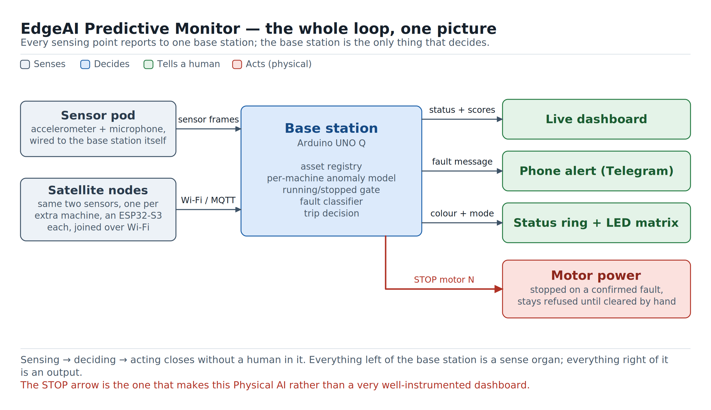

> **[PHOTO: hero shot — the assembled base station clipped to the test rig, machine running, status ring lit]**

## 1.2 What it actually does

* **Watches.** An accelerometer and a microphone sample a machine's vibration
  and sound tens of thousands of times a second, right at the machine.
* **Reduces.** The sampling chip turns that firehose into a compact spectrum
  plus a handful of shape statistics, several times a second, so nothing large
  ever has to travel anywhere.
* **Learns.** During a short guided setup, it trains a private model of what
  *this* machine's healthy state looks like — including each of the different
  ways it normally runs. Training happens on the UNO Q itself. No two machines
  share a baseline, because no two machines vibrate the same.
* **Notices.** Every new frame is scored against that baseline in real time and
  lands on healthy, warning or fault.
* **Diagnoses.** A second, separate model — trained in Edge Impulse, running
  on-device — names *which kind* of fault it is hearing: a bearing going, an
  imbalance, a loose mount. That one is trained per **machine type**, so five
  identical lathes share one model instead of five training runs.
* **Knows when the machine is off.** A dedicated gate tells running from
  stopped, so a switched-off machine reads as *idle*, not as *broken*. This
  turned out to be the single hardest measurement in the project
  ([Chapter 8](#chapter-8-the-day-it-stopped-itself)).
* **Acts.** On a confirmed fault, it stops that machine's motor — and refuses to
  let it restart until a person clears it by hand.
* **Tells someone.** A light on the machine, a live dashboard, and a phone
  alert, so a human finds out without staring at a screen.
* **Scales.** The base station watches its own machine directly; **satellite
  nodes** watch other machines over Wi-Fi. Adding the tenth machine is a
  power-up-and-onboard job, not a cabling job.

## 1.3 Where the project actually stands

| Capability | Status |
|---|---|
| Vibration + audio sensing (base station) | Built · live-verified on hardware |
| Guided six-step setup, per-machine anomaly model | Built · live-verified on hardware |
| Multi-condition training (no load / full load) | Built · live-verified on hardware, with a measured sensitivity cost ([§5.6](#chapter-5-teaching-it-what-normal-feels-like)) |
| Running/stopped gate with measured noise floor | Built · live-verified on hardware |
| Trip-output mapping confirmed by really stopping the machine | Built · live-verified on hardware |
| Physical motor stop on confirmed fault, latched | Built · live-verified on hardware, both directions |
| Fault-type classifier (Edge Impulse, per machine type) | Built · runs on-device · trained on 541 real captures from this rig |
| Live dashboard (5 tabs, live charts, controls, global trip banner) | Built · live-verified on hardware |
| Status ring + on-board LED matrix | Built · live-verified on hardware |
| Wi-Fi onboarding via captive portal (base station) | Built · live-verified on real phones |
| Satellite sensor nodes over Wi-Fi/MQTT | Built |
| Phone alerts (Telegram) | Built · demonstrated against a real bot; currently switched off pending one config value |
| Per-motor relay (cutting electrical power, not just motion) | **Not built** — [Chapter 13](#chapter-13-whats-next) |

## 1.4 Why this counts as Physical AI

Plenty of monitoring products stop at "notify a human." That is a real product,
but the intelligence never touches the physical world — it only narrates it.

The bar this project set itself is stricter: the loop from *sensor reading* to
*motor stopping* has to close with no human in it, end to end, on real hardware,
repeatably. [Chapter 8](#chapter-8-the-day-it-stopped-itself) is that loop,
including the mistakes made getting it trustworthy enough to arm.

Everything else in this report — the sensors, the wireless nodes, the models,
the dashboard — exists to keep that one loop honest and fast. Ravi's shop is the
excuse. The trip is the point.

## 1.5 The year this report follows

The chapters run in the order a real shop would meet them, and one shop's year
is used throughout to keep the "why" attached to the "what". Everything
technical in each chapter stands on its own; the shop is there so it is always
obvious what the engineering is *for*.

| | | Chapter |
|---|---|---|
| **Month 0** | One lathe arrives. Nobody is monitoring anything. | [1](#chapter-1-the-machine-that-never-complains-until-its-too-late) |
| **Month 1** | One sensor pod goes on the lathe. | [3](#chapter-3-building-the-base-station) |
| **Month 1, day 2** | The lathe is commissioned: "just let it run for a bit." | [5](#chapter-5-teaching-it-what-normal-feels-like) |
| **Month 7** | A compressor and a drill press, across the yard, out of cable reach. | [4](#chapter-4-growing-the-fleet) |
| **Month 9** | A second lathe. One classifier now covers both. | [6](#chapter-6-naming-the-fault), [7](#chapter-7-training-the-classifier-with-edge-impulse) |
| **Month 11** | 02:40 on a Tuesday. Something stops itself. | [8](#chapter-8-the-day-it-stopped-itself) |
| **Month 12** | Ravi runs more machines than he can personally watch. | [13](#chapter-13-whats-next) |

---

# Chapter 2. Why the Arduino UNO Q

> **Month 1.** Ravi's shed has one spare socket, a lot of aluminium dust, and no
> room whatsoever for a rack. Anything that needs three boards, two power bricks
> and a fan is not going to survive its first week in there.

## 2.1 One board doing four jobs at once

This system has to do four things that normally do not live on the same board:

1. Sample two sensors at tens of thousands of samples per second and never miss
   a window — that is a job for a microcontroller with real-time guarantees.
2. Run FFTs and statistics on those windows continuously, without stealing time
   from step 1.
3. **Train** a neural network, from scratch, in the field, while a technician
   waits — that is a job for a Linux machine with a real Python stack.
4. Serve a live dashboard, run an MQTT broker, hold a database of assets, and
   talk to Telegram — that is a job for a networked server.

The conventional answer is two or three boards: a microcontroller for 1–2, a
single-board computer for 3–4, and a bridge between them that somebody has to
design, debug and power. The UNO Q is that whole arrangement already built,
already routed, already sharing one power supply and one USB connector.

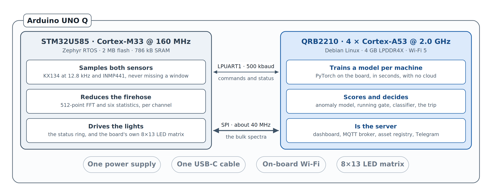

**What we actually use, and where:**

| UNO Q capability | What it does in this project |
|---|---|
| **STM32U585 (Zephyr RTOS)** | Samples the KX134 over SPI and the INMP441 over SAI, runs the FFTs, computes six statistics per channel, drives the WS2812 ring and the LED matrix |
| **QRB2210 (Debian Linux, quad-core)** | Trains and runs the per-machine autoencoder in PyTorch, runs the Edge Impulse fault classifier, holds the asset registry, serves the dashboard, hosts the MQTT broker, publishes trips |
| **LPUART1 between the two** | Control-plane RPC between the halves, at 500 kbaud |
| **Dedicated MCU↔MPU SPI** | The bulk telemetry path — full-resolution spectra at ~40 MHz, so the control link never has to carry them |
| **On-board 8×13 LED matrix** | Fleet-wide health summary, readable across a workshop with no laptop open |
| **On-board Wi-Fi** | The shop network client, the MQTT broker's home, *and* a fallback access point for onboarding |
| **Arduino App Lab** | Packaging, deployment and secret management for the Linux-side application — see [§2.3](#chapter-2-why-the-arduino-uno-q) |
| **Adreno 702 GPU** | Evaluated for model inference. Confirmed working via Vulkan, and then deliberately **not** used — see [§2.4](#chapter-2-why-the-arduino-uno-q) |

## 2.2 The part that would be hardest to replace

Not the sensing. Not the dashboard. **The on-device training.**

Commissioning means a technician walks up to a machine, runs it for a few
minutes, and expects a trained, working monitor before they walk away. That is
only possible because the QRB2210 side is a genuine Linux computer running
genuine PyTorch — it fits and trains a small dense autoencoder locally, in
seconds, with no cloud round trip and no data ever leaving the building.

Take the Linux half away and the design changes shape completely: you are now
shipping every machine's vibration signature to a server, waiting on a training
job, and pushing a model back — which turns a five-minute walk-up task into a
workflow with a network dependency, a queue, and a data-governance conversation.
Take the microcontroller half away instead and you lose the deterministic
sampling that makes the spectra worth training on in the first place.

The UNO Q is one of the few boards where "sample it properly" and "train on it"
are the same purchase order.

## 2.3 What App Lab actually does here

App Lab is not a nicety in this build; it is the thing that makes the Linux half
shippable rather than a pile of scripts somebody has to remember to start.

* **One application, one deploy.** `base-station/app.yaml` declares the app's
  name, its icon and the ports it exposes — 8080 is the dashboard. App Lab
  builds it, ships it to the board and runs it in its own container. The build
  script in
  [Appendix C](#appendix-c-build-one-yourself) is a thin wrapper around that.
* **Secrets stay out of the repository.** The Telegram bot token is an App Lab
  **brick** variable (`arduino:telegram_bot`), typed into App Lab's own
  interface, never committed and never printed. With the token unset, every
  alert path in the code no-ops cleanly rather than crashing — which is the
  state the current build ships in, and which is why the Alerts tab says so out
  loud instead of pretending.
* **Both halves in one project.** The Zephyr sketch under
  `base-station/sketch/` and the Python application under
  `base-station/python/` are flashed and deployed from the same tool, which
  matters a great deal when a wire-format change has to land on both sides at
  once ([Appendix F](#appendix-f-wire-protocol-specification)).

The honest note: the frontend is deliberately **not** built with a Brick. The
dashboard is plain HTML, CSS and five self-contained JavaScript modules with no
framework, no bundler and no build step — because a live 15 frames-per-second
Plotly view with per-asset state was easier to keep correct as explicit code
than as a generated UI. Bricks earn their keep on the parts where the
integration is the hard bit, which for this project is the bot token, not the
charts.

## 2.4 What we pushed on, and what pushed back

An honest hardware section says where the board's limits are, not just its
features. Three things were tested to the edge:

* **Accelerometer output data rate.** The KX134 will run at 25.6 kHz. We run it
  at **12.8 kHz**. At the full rate, the sampling thread stopped yielding often
  enough and starved the inter-processor link outright — telemetry frames went
  to zero. 12.8 kHz is eight times the original baseline with real headroom
  left. Full numbers and the reasoning:
  [Appendix G](#appendix-g-sensor-configuration-envelope).
* **The internal UART.** Raised from the stock 115200 to **500000 baud** after
  root-causing why higher rates failed: the Linux side derives its baud from a
  32 MHz reference with 16× oversampling, so 1 Mbaud and 2 Mbaud land on
  divisors of 2 and 1 — right at the edge where the receiver loses sampling
  margin. They boot beautifully and then wedge twenty minutes later, which is
  the worst kind of working. 500000 lands on a divisor of exactly 4 and survived
  every soak test, including one longer than the exposure that broke the next
  rate up.
* **The GPU.** The Adreno 702 was spiked properly rather than assumed. Two
  findings: the vendor TFLite GPU wheels are compiled for ARMv8.1 atomics this
  CPU does not have, so loading them kills the process outright — not an
  exception you can catch, an illegal instruction that takes the whole
  application with it. And via a Vulkan backend that *does* work, bit-exact
  against CPU, the measured speed-up stayed at ~1.0× from a single vector all
  the way up to a 256-node batch. These models are 536 numbers wide. Sending
  them to a GPU is chartering a cargo ship to post a letter.
  **Staying on CPU is a finding, not a shortcut.**

None of these are complaints. They are the kind of thing you only learn by
running a board hard for weeks, and all three are documented here so the next
person doesn't have to rediscover them.

---

# Chapter 3. Building the base station

> **Month 1.** One pod, one machine, one afternoon. Ravi does not want a pilot
> programme. He wants to know whether the lathe he is still paying for is going
> to be fine.

## 3.1 One board, one machine

The simplest useful version of this system is one sensor pod bolted to one
machine. That is the **base station**: an Arduino UNO Q with an accelerometer
and a microphone wired to it, watching one motor, showing its own status on a
light, and serving the dashboard.

If you stopped right here you would already have something most small shops
don't: a machine that tells you it is getting sick before it collapses.
Everything else in this report is this same idea, repeated and connected.

> **[PHOTO: base station fully wired and clipped to the test rig — sensor, board and status ring in one wide shot]**

## 3.2 What you are building

Three peripherals hang off the real-time half of the board, and nothing hangs
off the Linux half:

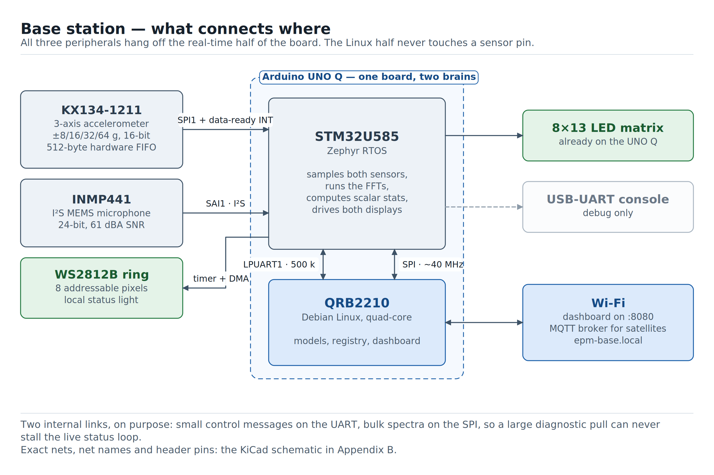

* The **KX134-1211** accelerometer on SPI, with a chip-select and a
  buffer-full interrupt line. Its 512-byte hardware FIFO is doing real work
  here: without it the host would need servicing roughly every 39 microseconds
  at full rate, which is a hostile interrupt load for a chip that also has FFTs
  to run.
* The **INMP441** microphone on the STM32's SAI peripheral, giving 24-bit
  digital audio with no analogue front end to design.
* The **WS2812B ring** on a timer channel with DMA, so the strict bit-banged
  timing those LEDs need never depends on the scheduler being free.

The exact pin for every net is in
[Appendix B](#appendix-b-wiring-and-pinout-reference), which also carries the
real KiCad schematic. The parts, prices and buy links are in
[Appendix A](#appendix-a-bill-of-materials). Both appear exactly once in this
document, on purpose — there is one place to look for each.

**Where you put the sensor matters as much as which sensor you bought.** An
accelerometer read through a soft or loose mount is a low-pass filter you did
not ask for, and it removes exactly the high-frequency content that early
bearing faults live in. Rigid coupling to the machine housing, as close to the
bearing as the geometry allows, is not an accessory decision.

## 3.3 First light

The full command-by-command build is [Appendix C](#appendix-c-build-one-yourself).
The short version is two steps: flash the sketch onto the STM32 side through
Arduino App Lab, then run one script that builds, pushes and starts the Linux
application and prints the board's own LAN URL.

Open that URL and the machine appears on its own. Nothing has been trained yet
— that is [Chapter 5](#chapter-5-teaching-it-what-normal-feels-like) — but the
sensing half of the loop is already complete and watchable: live vibration and
audio spectra, live time-domain traces, and a status ring that has gone solid
the moment real data started flowing.

## 3.4 Why there are two chips talking to each other

The STM32U585 side is close enough to the hardware to keep up with a sensor that
does not wait for anyone. The QRB2210 side has the memory and the operating
system to train a model and serve a web page at the same time. Between them run
two separate links, and the split between those two links is deliberate:

* **LPUART1** carries small control messages — remote-procedure calls, status
  pushes, statistics queries. A few numbers, often.
* **A dedicated SPI bus** carries the bulk telemetry — full-resolution spectra
  and raw diagnostic pulls. A lot of numbers, occasionally.

Keeping them apart means a large diagnostic capture can never stall the
real-time status loop that everything else depends on. That separation was not
free — it was the result of an earlier design where everything shared one link
and a bulk stream wedged the control channel. [Chapter 10](#chapter-10-under-the-hood)
has the full data path; [Appendix F](#appendix-f-wire-protocol-specification)
has the framing.

---

# Chapter 4. Growing the fleet

> **Month 7.** The shed now holds a second lathe, a drill press, and a
> compressor that lives outside under a tin roof because it is loud and it
> smells. None of them is within cable reach of the first machine, and Ravi is
> not running conduit across a yard for a monitoring system.

## 4.1 Machine number two

Running wire to every new machine isn't a plan, it's a standing chore.

**Satellite nodes** solve that. Each one is a small self-powered sensor pod —
same accelerometer, same microphone, same status ring as the base station — that
watches its own machine and reports over Wi-Fi. The dashboard does not
distinguish wired machines from wireless ones. A satellite just shows up as one
more asset in the list, next to the original.

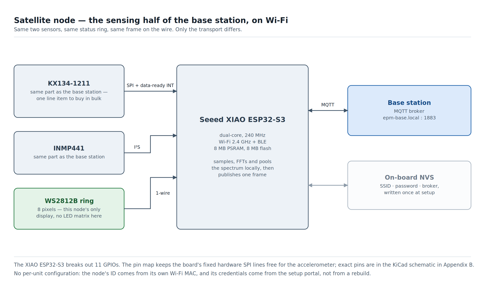

> **[PHOTO: a satellite node mounted on a second machine, powered and running]**

## 4.2 Onboarding one, start to finish

This is the part most projects gloss over, so here it is in full — because it is
the difference between a demo and something a shop can actually adopt.

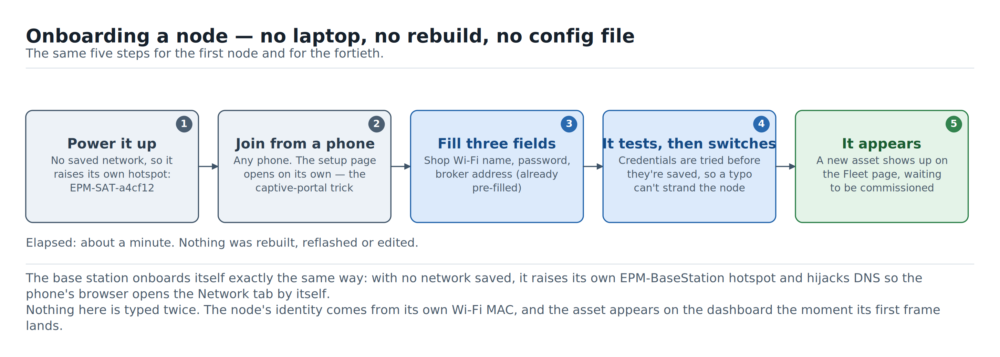

**1. Power it up.** A node with no saved credentials does not sit there blinking
an error. It raises **its own Wi-Fi access point**, named from its own hardware
address — `EPM-SAT-a4cf12`. The name is unique per node, so ten unconfigured
nodes on a bench are ten distinguishable networks, not one collision.

**2. Join it from any phone.** No app. The moment the phone joins, the setup
page opens by itself. That is the captive-portal mechanism real airport Wi-Fi
uses — the node answers every DNS query with its own address, so whichever
connectivity-check URL the phone reaches for lands on the setup form instead,
and the operating system pops its browser open on it. The same trick, used for
good instead of for selling you thirty minutes of internet.

**3. Fill in three fields.** The shop's Wi-Fi name, its password, and the
address of the MQTT broker — which comes **pre-filled** with `epm-base.local`,
the base station's own mDNS name. It is a field rather than a constant because
mDNS is sometimes blocked on factory VLANs, and when it is, a technician needs
to be able to type an address rather than reflash a board.

**4. It tests before it commits.** Submitting does not blindly save. The node
tries the credentials first and only writes them to its non-volatile storage on
success, so a typo cannot strand a device on a machine you now need a ladder to
reach. On success its own access point drops and it joins the real network.

**5. It appears.** No pairing step, no ID to type in, no dashboard form. The
node derives its identity from its own Wi-Fi MAC and starts publishing; the
asset shows up on the Fleet page the moment the first frame lands, ready to be
named and set up.

> **[SCREENSHOT: the satellite setup portal on a phone, and the Fleet page with the new asset appearing]**

**The base station onboards itself the same way.** With no network saved, it
raises an `EPM-BaseStation` hotspot and runs the same DNS trick, redirecting any
request to its dashboard's Network tab — where the same "pick a network, type a
password" flow is waiting. That flow has been tested on real phones, and three
rounds of live testing went into details that only show up on real hardware:

* The network list is a set of **tappable buttons**, not a native autocomplete
  field. An earlier version used an HTML `<datalist>`, which mobile browsers
  render unreliably or, in several cases, not at all — the list simply never
  appeared, and the operator was left typing an SSID from memory.
* The warning that *"this page may close when you tap Connect — that's normal"*
  appears **before** the button rather than after it, because the device's own
  network switches out from under the page too quickly to read a message that
  only appears afterwards.

Both of those are one-line changes that no amount of desk testing would have
produced.

## 4.3 One format, every node

A satellite node and the base station's own sensing half speak the identical
language on the wire: the same generic *here is a channel, here is its spectrum,
here are its statistics* frame, whether it arrives over the internal SPI bus or
over MQTT from across the floor.

That is deliberate, and it buys three things:

* The scoring pipeline never learns which kind of node a machine is behind. It
  routes, validates and scores one frame shape.
* Adding a satellite is a wiring-and-power task, not a software task.
* It is what makes "one trained classifier covers every lathe of this type"
  possible at all — a base-station-monitored lathe and a satellite-monitored
  lathe hand the model data shaped exactly the same way.

The frame layout, both framings and the schema that keeps the three codebases
from drifting apart are in
[Appendix F](#appendix-f-wire-protocol-specification).

---
# Part II — The intelligence

# Chapter 5. Teaching it what normal feels like

> **Month 1, day 2.** The pod is on the lathe and the dashboard is up. Ravi
> asks the obvious question — *so what does it think?* — and the honest answer
> is: nothing yet. It has never met this machine. Give it four minutes.

## 5.1 "Just let it run for a bit"

Before this system can say something is wrong, it has to know what *right*
sounds like — and every machine's right is different. A new lathe hums
differently from one that has run for a decade; a compressor's normal vibration
looks nothing like a drill press's.

So the first thing that happens with a new machine isn't detection, it's
listening. An operator opens the machine's setup drawer and works down a short
list of steps: name it, measure it switched off, run it, train it, and prove
which motor it is wired to. Four to six minutes later that machine has its own
model, its own thresholds, and a tested emergency stop.

> **[SCREENSHOT: the setup drawer open on step 3, showing two named conditions collecting — "Running 41/50" and "Full load 12/50"]**

## 5.2 The six steps

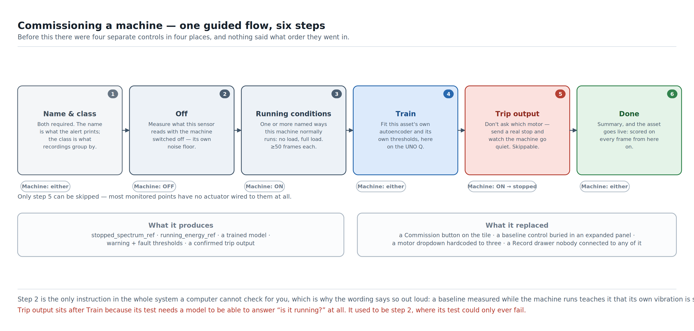

| # | Step | Machine | Required | What it produces |
|---|---|---|---|---|
| 1 | **Name & class** | either | yes | The name alerts print, and the class recordings group by |
| 2 | **Off** | **switched off** | yes | This sensor's own noise floor, per frequency bin |
| 3 | **Running conditions** | **running** | yes (≥1) | The training batch, the gate's running reference, and labelled healthy recordings |
| 4 | **Train** | either | yes | This asset's own model, its normalisation statistics and its two thresholds |
| 5 | **Trip output** | running → stopped by us | no | Which motor stops this machine — *confirmed*, not guessed |
| 6 | **Done** | either | — | A summary; the asset goes live |

**This replaced four separate controls in four different places.** Before it,
an operator had to find a Commission button on the machine's row, a stopped-
baseline control buried inside an expanded panel, a trip-motor dropdown
somewhere else again, and a Record drawer that nothing connected to any of them.
Nothing told them these were related, and nothing said what order they went in —
even though the order genuinely matters: without a stopped baseline the gate can
barely tell running from stopped, so a training batch collected before one was
calibrated against a weak gate.

Three details in that list are worth their own paragraph.

**Step 1 is mandatory, and that is new.** Neither a name nor an asset class used
to be required. Both are now, with no skip. The name is what a Telegram alert
and the trip banner print, and *"Tripped — esp32-a4cf12 at 02:40"* is the wrong
thing to read at 02:40. The class is what recordings are grouped by, and making
it optional would mean a silent conditional branch through the rest of setup:
recordings quietly not saved, discovered weeks later by somebody trying to train
a classifier. One typed word is cheaper than that branch. It also gets easier as
the fleet grows — on day one it is free text, and after that it is a pick-list
of classes that already exist.

**Step 2 is the one instruction no computer can check.** Nothing in the software
can confirm that the machine is actually switched off, so the wording says so
out loud rather than pretending: *"Switch the machine off. Confirm it has
stopped moving, then Start. Nothing here can check that for you — a measurement
taken while the machine runs teaches the system that its own vibration is
silence."* Why that measurement matters at all is
[Chapter 8](#chapter-8-the-day-it-stopped-itself).

**Step 5 used to be step 2, and moving it was a real correction.** The original
argument was appealing: the trip test *ends* with the machine stopped, which is
exactly the state step 2 needs, so the operator would switch the machine off
once instead of twice. That saving never existed. The test refuses to run unless
the gate reports the machine running; the gate cannot answer that at all until a
model exists; the model is not fitted until Train. At position 2 the test could
only ever fail — nothing was published, the machine never stopped, and the
operator switched it off by hand for step 2 anyway. The early position bought an
operator action it did not save, at the price of an untestable step on every
fresh asset. It is now step 5, where every precondition it needs already holds.

Setup state lives in memory only. Restart the dashboard mid-setup and the
current step restarts — half-collected batches are deliberately not persisted,
because a batch resumed across a restart is worse data than a fresh one.

## 5.3 Don't ask which motor. Prove it.

Step 5 is the one an operator remembers, and it is the design decision this
project is proudest of.

The old version was a dropdown with three motors in it, because the number three
was hardcoded in the frontend to match the bench rig. A factory with one motor
saw three options, two of which were fiction. Worse, whichever one the operator
picked was never verified — you found out whether "Motor 2" really stopped *this*
machine during the first real fault, which is the worst possible moment to
discover it was wired to the neighbouring one.

What happens now:

1. The motor rig **announces its own outputs** on connect, as a retained MQTT
   message. The dashboard shows exactly the outputs that exist. One motor on day
   one, five when there are five, with no dashboard change.
2. The operator leaves the machine running and presses **Test** next to a
   candidate output.
3. The system sends a **real stop** — the same command, same code path, same
   payload as a genuine trip — and then watches this node's own vibration gate.
4. The machine goes quiet within the confirm window → the mapping is
   **confirmed**, and stamped with the date. It keeps running → wrong output, or
   a broken trip path; try the next candidate.

That buys three things beyond deleting a dropdown. The mapping is verified
against physics rather than against somebody's memory. It is a genuine
end-to-end test of the entire trip path — MQTT topic, rig subscription, motor
halt, gate confirmation — performed at setup time instead of during the first
emergency. And it is honest about what it doesn't know: a manual *"use without
testing"* fallback exists for a machine that can't be cycled right now, and it
records the mapping as **unconfirmed**, and says so on the tile. Unconfirmed is
honest. A confirmed-looking guess is not.

The safety invariant survives all of this intact: **the only command this system
can ever send is stop.** There is no code path anywhere that can set a speed or
start a machine. The operator starts the machine by hand, at the machine, both
before the test and after it.

## 5.4 What "normal" means to a machine

Every incoming frame becomes a **feature vector** — a compact numerical
fingerprint of that moment, not the raw waveform.

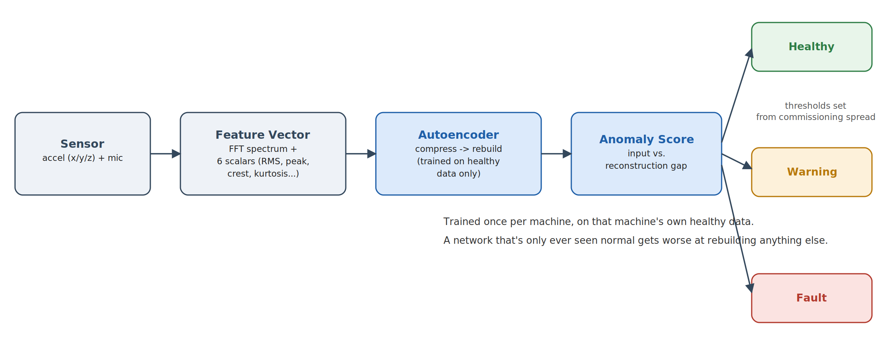

For each sensing channel — vibration on X, Y and Z, plus audio — the system
keeps two very different kinds of information:

* **The spectrum.** How much energy sits at each frequency, peak-normalised so
  the model learns the *shape* of the spectrum rather than how hard the machine
  happens to be loaded at that instant.
* **Six shape statistics.** RMS, peak, crest factor, kurtosis, skewness and
  standard deviation, computed on the time-domain window. These describe things
  a spectrum alone hides — particularly impulsiveness, which is exactly what a
  failing bearing produces.

Those statistics are computed **per axis**, never on a combined tri-axial
magnitude. That is not a stylistic choice: combining X, Y and Z into one
magnitude erases the directional signature an imbalance produces, and an offline
sweep over real captures measured the difference as **+1.8σ fused versus +38.5σ
per-axis** on the same data. It is one of the highest-leverage decisions in the
whole pipeline, and it came out of measurement rather than intuition.

The result is a 536-number vector: 128 spectral bins × 4 channels, plus 6
statistics × 4 channels.

## 5.5 The autoencoder, and why an unsupervised model

An **autoencoder** is a small neural network whose only job is to squeeze its
input down through a bottleneck and rebuild it. Train one on nothing but a
machine's healthy data and it becomes very good at rebuilding that machine's
normal — and noticeably worse at rebuilding anything else. The size of that gap
is the **anomaly score**.

The reason for choosing this shape over a supervised classifier as the primary
detector is practical, not academic: **nobody has labelled fault data for a
machine that has not failed yet.** A supervised model needs examples of the
thing you are trying to prevent. An autoencoder needs only examples of the
machine behaving, which is the one thing every shop has an endless supply of.
That is what makes setup a five-minute job instead of a data-collection
campaign.

The network is deliberately small — a symmetric dense encoder/decoder whose
hidden and bottleneck widths scale from the input dimension rather than being
hardcoded, so the same code fits a mic-only node and a full four-channel one.
Training a fresh model takes seconds on the QRB2210, with live percentage
progress pushed to the browser, and the operator is explicitly told they can
walk away: *"You can leave this page — it finishes on its own."*

## 5.6 More than one kind of normal

A machine does not have one healthy state. A lathe idling, a lathe cutting
aluminium and a lathe cutting steel vibrate differently, and all three are fine.
Show the model only one of them and the other two are off-manifold — which means
the machine reads as faulty every time the shift changes what it is doing.

Step 3 therefore collects **named conditions**, not one batch. The default and
only mandatory one is *Running*. An operator can add *No load*, *Full load*, or
anything they want to type, and each collects its own ≥50 frames with its own
live counter. Day one, on a simple machine, they add none and the step behaves
exactly as a single commissioning batch used to.

Those frames go three places at once:

1. **Pooled into one training batch.** All conditions together, one model, one
   healthy manifold that now spans the machine's real duty range.
2. **The gate's running reference** is taken from the **quietest** condition,
   not the pooled median. The gate's running threshold is a fraction of that
   reference, and it still has to call the machine's quietest legitimate running
   state "running". A pooled median dragged upward by a loud full-load condition
   would push that line above the machine's own no-load level, and a machine
   idling normally would read as stopped.
3. **Saved as recordings**, one file per condition, all under the same label
   `healthy`, with the condition name recorded alongside. The shared label is
   deliberate: `healthy_no_load` and `healthy_full_load` as separate labels would
   hand the fault classifier ([Chapter 7](#chapter-7-training-the-classifier-with-edge-impulse))
   two classes that both mean "fine".

### The cost of this, measured

Pooling conditions widens the healthy reconstruction-error spread, so the
thresholds — which are placed relative to that spread — sit higher, and
sensitivity drops. That was expected. What was *not* expected is how much.

Measured on the rig, same frame counts, same everything else:

| Training conditions | Warning threshold | Fault threshold |
|---|---:|---:|
| `slow_90rpm` alone | 0.146 | 0.292 |
| `slow_90rpm` + `fast_150rpm` | 0.745 | 1.490 |

**5.1× wider.** And it has a consequence you can watch happen: a 220 RPM
overspeed — 2.4× the commissioned speed, an unambiguous fault — scored 1.851 and
tripped in about eleven seconds under one condition. Under two conditions it
never crossed 1.490 at all.

That is a real sensitivity loss, and it is stated here rather than buried,
because the feature is genuinely useful and genuinely not free. The trade is
still the right one for a machine with a real duty cycle: a slightly higher line
that never false-alarms on a normal load change beats a tight line that cries
wolf at the start of every shift. But it should be quantified per machine before
being promised to an operator, and the honest next step — per-condition
thresholds, or a condition-aware model — is on the roadmap in
[Chapter 13](#chapter-13-whats-next) rather than claimed as done.

## 5.7 From a score to a status

A single number is not a status. Two thresholds turn it into one, and both are
derived from what this machine's own healthy data actually looked like:

* **Warning** at μ + 8σ of the healthy score distribution.
* **Fault** at μ + 15σ, with guards so that fault > warning > 0 always holds
  even for a degenerate near-zero-spread batch.

The margins are wide because healthy scores cluster very tightly right after
training on that same data, so a few sigma is a tiny absolute distance.

A fixed global threshold cannot work here, and this is worth being explicit
about because it is the most common way a project like this fails quietly: the
autoencoder's reconstruction error is measured in units set by that machine's
own spectrum. What reads as comfortably healthy on one motor reads as a fault on
another. Calibrating per machine is what makes a real fault actually cross the
line on the dashboard instead of sitting in the noise.

Crossing the fault line once is not enough either — a fault must persist across
consecutive frames before the status changes, so one noisy sample never cries
wolf.

## 5.8 Knowing when the machine is simply switched off

There is a third thing scoring a frame, alongside the model: a **running/stopped
gate**. Its whole job is to answer "is this machine even turning right now?"
from vibration energy alone.

It matters for three reasons. A machine switched off an hour ago should read as
*idle*, not keep displaying whatever status it held while it was last running.
The trip-output confirmation in [§5.3](#chapter-5-teaching-it-what-normal-feels-like)
is nothing but this gate, watched carefully. And when a real trip fires, the only
honest way to know it actually worked is to watch the machine go quiet.

Getting that measurement right turned out to be the hardest single problem in
the project — the sensor's own noise floor is loud enough to look like a running
motor. That story is [Chapter 8](#chapter-8-the-day-it-stopped-itself), and the
full investigation is [Appendix H](#appendix-h-motor-state-gate-calibration).

## 5.9 How hard can you push the sensing?

A reasonable question from anyone planning to point this at a machine with a
different fault signature: what is the ceiling?

Short version — the accelerometer can run to **25.6 kHz**, giving usable
frequency content to about 12.8 kHz, and the FFT depth and how much of it goes
on the wire are both independent, tunable knobs. What we run today is one point
in that envelope, chosen for stability, not the maximum.

The full envelope — every rate, every bin count, what each costs in bandwidth
and in CPU, what happens at the extremes, and how to change it — is
[Appendix G](#appendix-g-sensor-configuration-envelope).

## 5.10 Why train here rather than in the cloud

Two reasons, in this order.

**Setup has to feel instant.** A technician standing at a machine will wait a
minute. They will not wait for a queued cloud job, and they certainly will not
come back tomorrow. Training locally keeps commissioning something you start and
finish in one visit.

**The data never has to leave.** A machine's vibration signature is a fairly
intimate record of how a business operates — how many hours it runs, how hard,
and when it stopped. Keeping training on-device means "does our data leave the
building?" has a clean answer — *only if you choose to send it* — which stops
being a technical question and starts being a procurement one the moment a
customer is larger than one shop.

---

# Chapter 6. Naming the fault

> **Month 9.** A second lathe arrives, same model as the first. Ravi's
> reasonable expectation is that the system already knows something about
> lathes. He is right, and that is the whole point of this chapter.

## 6.1 Beyond "something's wrong"

Healthy / warning / fault answers *whether* something is off. It does not
answer *what*, and "what" is the difference between "stop everything" and
"order a bearing for Thursday."

So there is a second model: a supervised classifier that names the fault
category it is hearing — bearing wear, imbalance, a loose mount. It runs
on-device, on the same feature vector the anomaly model sees, and its result
appears next to the machine's status the moment there is a fault to explain.

> **[SCREENSHOT: an expanded asset row showing the fault-classification confidence bars]**

## 6.2 One model per machine *type*, not per machine

This is the important structural difference from
[Chapter 5](#chapter-5-teaching-it-what-normal-feels-like), and it is the reason
the two models are built completely differently.

The anomaly model is **per machine**, because it models *this unit's normal* and
normal is a property of one physical installation. The classifier is **per
machine type**, because what distinguishes a bearing fault from an imbalance is
a property of the *fault*, not of the unit — and pooling every lathe's data
gives it far more to learn from than any one lathe could.

Concretely: every asset carries an **asset class** (`cnc lathe`, `conveyor
motor`, …), set in step 1 of setup. Recordings are grouped by that class, one
Edge Impulse project is linked per class, and the trained model that comes back
applies to every asset in it. Train once, cover the whole line.

The dashboard is built around that idea rather than bolting it on: the
Classifier tab shows **one card per asset class**, not one per node. The
normalisation baseline is fitted from every recording pooled across the class,
so units with slightly different mounting don't each drag the model in their own
direction.

## 6.3 What the classifier is, and is not, allowed to do

The classifier **names** faults. It never decides whether to stop a motor.

That separation is structural, not a policy someone has to remember: the trip in
[Chapter 8](#chapter-8-the-day-it-stopped-itself) runs off the anomaly gate
alone and has no code path that reads a classification. If the classifier is
ever wrong about *which* fault it is, the machine still stops — the label on the
alert is just wrong, which is a bad afternoon rather than a bad outcome.

An asset with no class assigned, or a class with no trained model, simply shows
the anomaly score and no classification. Nothing breaks, and nothing displays an
empty placeholder promising a feature that isn't configured.

How that model actually gets built, uploaded, trained and fetched is the whole
of the next chapter.

---

# Chapter 7. Training the classifier with Edge Impulse

## 7.1 Why Edge Impulse at all

Building a training pipeline from scratch for the fault classifier was genuinely
on the table, and it was the wrong use of the time available. Edge Impulse is
built for exactly this category of problem — labelled sensor data in, a
deployable embedded model out — and using it meant the effort could go into the
parts nothing provides off the shelf: the running/stopped gate, the trip chain,
the fleet dashboard.

There is a second, structural reason. Keeping the classifier's training
completely outside this codebase is what keeps it structurally independent of
the safety path. The trip cannot depend on a model it has no code path to read.

## 7.2 The round trip

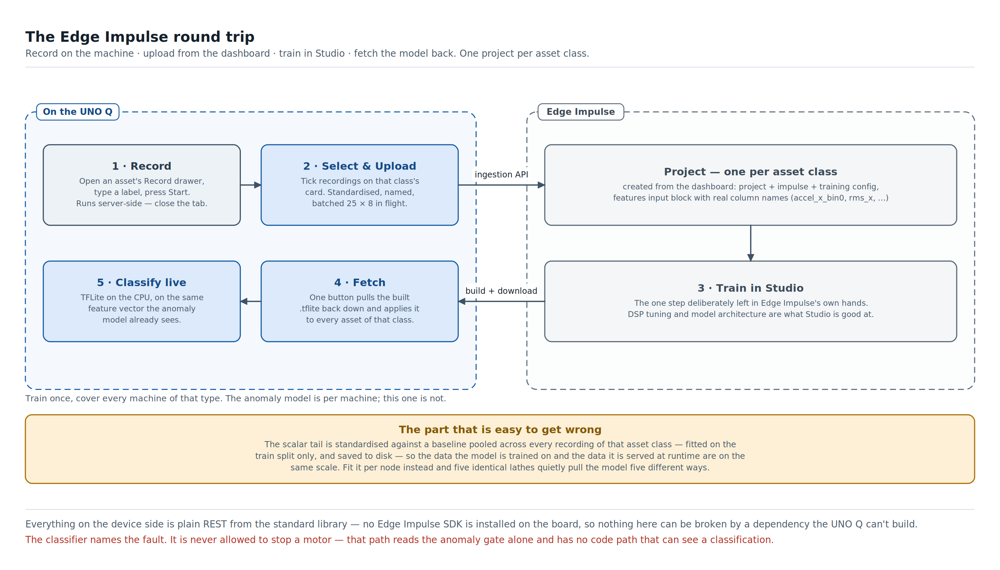

Five steps, and only one of them happens outside the dashboard.

## 7.3 Record — capturing a fault without leaving the page

An operator hears something, or the anomaly score climbs, and wants that moment
kept. On the machine's row there is a **Record** drawer: type a label
(`healthy`, `bearing`, `unbalanced`, `loose` — previously used labels are
offered as suggestions so a fleet doesn't accumulate `bearing`, `Bearing` and
`bearing2`), optionally set a frame count, press Start.

Capture runs **server-side**. Closing the drawer doesn't stop it. Closing the
browser doesn't stop it. The row's record button just keeps pulsing until you
come back — which matters because the useful captures are the long ones, and
nobody wants to babysit a tab for four minutes next to a running lathe.

Setup contributes to this automatically: every running condition collected in
step 3 is also saved as a `healthy` recording
([§5.6](#chapter-5-teaching-it-what-normal-feels-like)), so the *healthy* class
fills itself as the fleet is commissioned. The fault classes are the ones a
human has to go and produce.

## 7.4 Link — one project per asset class, created from the dashboard

On the Classifier tab, each asset class has a card, and an unlinked card has one
button: **Link to Edge Impulse**. It asks for an Edge Impulse username and
password — and a TOTP code if the account has two-factor authentication turned
on, because a real account probably does.

What happens on submit is three REST calls, not a redirect to Studio:

1. **Create the project** for this asset class, which returns a scoped API key
   in the same response. That key is the only server-side secret this
   application persists that was typed into the dashboard rather than passed in
   at startup, so it is written owner-only (`0600`) — tighter than the registry
   or the captures, neither of which carries a secret. The username, password
   and session token used to *create* the project are never written anywhere;
   they exist in memory for the duration of that one call.
2. **Create the impulse** — a fixed template: a `features` input block, a
   passthrough DSP block, and a Keras learn block.
3. **Set the training configuration** — layers, epochs, learning rate, batch
   size, from the same fixed template every time.

Steps 2 and 3 are identical JSON for every asset class; only the project ID
changes. Adding a new machine type to the fleet is therefore one button, not a
Studio session.

**A detour worth recording,** because it cost a day and the answer is not
obvious. The impulse's input block went through two wrong shapes before this
one. The first used a `features` block with a single invented axis name, which
matched none of the axes Edge Impulse derives from a CSV's header row — so the
DSP block's axis selection came back empty and nothing trained. The second used
a `time-series` block sized so the whole 536-number vector fit in one window;
that worked, and was rejected anyway, because this data is a precomputed feature
vector and not a time series, and shipping a workaround as an architecture is
how you end up maintaining it forever. The version that shipped is a `features`
block with **real per-column names** — `accel_x_bin0` … `accel_x_bin127`,
`accel_x_rms`, `mic_skewness` — generated from that node's actual sensor
configuration, matched by a wide CSV whose header row carries exactly those
names.

That naming bug is also the best argument in this report for testing against the
real external service rather than only against a local fake: every local test
passed throughout.

## 7.5 Upload — the part that is easy to get wrong

Tick the recordings you want on that class's card and press **Upload**. What
happens underneath is more careful than the button suggests.

* **The scalar tail is standardised first.** Live inference always standardises
  the six-statistics tail of the vector before scoring. Uploading raw vectors
  would have trained the classifier on a different distribution than it sees at
  runtime — the definition of train/serve skew, and a bug that produces a model
  that tests beautifully and then behaves oddly on the machine.
* **The baseline is pooled across the whole class, not per node.** An earlier
  version standardised each capture against its own node's commissioning
  statistics. That silently produced inconsistent data across nodes — five
  identical lathes each pulling the model a slightly different way — and it made
  uploading depend on commissioning, which capture and upload were never
  supposed to require. The baseline is now fitted once per asset class from
  every local recording of that class, and **saved to disk**, so anything that
  later runs this classifier standardises exactly the way the training data was
  standardised.
* **It is fitted on the train split only.** Fitting normalisation statistics
  over the test rows as well is a small, respectable-looking way to leak.
* **The train/test split is contiguous.** Each fault condition on this rig
  exists as one continuous capture rather than many independent short samples,
  so a random split would put adjacent, near-identical windows on both sides of
  the line. The last portion of each file is reserved for test and never seen in
  training. This is a real methodological limitation of one-capture-per-class
  data and it is stated rather than papered over — see
  [Appendix I](#appendix-i-classifier-research-history).
* **It is batched, and it streams progress.** Samples go up 25 per request with
  eight requests in flight, because the round-trip latency dominates the tiny
  payload and a few hundred samples one-at-a-time is a long, silent wait. The
  dashboard shows *"Uploading… 22 / 60"* with a running success/failure count
  and any failures listed inline by capture ID — not one modal at the end saying
  something went wrong.

## 7.6 Train — the one step deliberately left in Studio

The dashboard used to have a Train button. It was removed on purpose.

Everything after "the data is in the right project" — DSP parameter tuning,
model architecture, looking at a confusion matrix and deciding what to do about
it — is exactly the kind of work Edge Impulse Studio is genuinely better at than
a button in somebody else's dashboard. Automating it would have meant either
freezing one architecture forever or rebuilding a worse version of Studio's UI.

The card links straight to that class's project. Training happens there. Fetch
is the only glue that has to exist, because nothing else can pull the compiled
artefact back down onto the board.

Two alternatives were investigated first and rejected, so they don't get
re-proposed:

* **Letting Edge Impulse's own "Normalize features" DSP toggle do the scalar
  standardisation.** Confirmed against the docs and a live project: it
  normalises the entire DSP block output, not a selectable subset of columns,
  and this impulse's `features` input block exposes exactly one axis. There is
  no way to scope it to just the six statistics.
* **Splitting the vector into separately named axes** so the scalar tail could
  route through its own normalised block. Uncertain whether the `features` input
  type supports multi-axis samples at all — Edge Impulse's multi-axis ingestion
  format is built around real time-series semantics, which this data is not.

## 7.7 Fetch — one button, and the model is live

**Fetch trained model** on the class's card runs a build job in Edge Impulse
(`engine: tflite`), downloads the resulting deployment archive, pulls the single
`.tflite` out of it, and saves it under that asset class's name.

It is a background job — an Edge Impulse build is real minutes, not a
request/response — and progress streams to the browser over the dashboard's own
WebSocket as named stages: *building*, *downloading*, *done*. If you refresh the
page mid-job, the card still shows the job running, because job state is server
side and the status endpoint reports it.

From the moment that file lands, **every asset of that class is being
classified**, with no restart and no per-node action.

## 7.8 Run — on the CPU, and that is final

Inference is TFLite on the CPU, via XNNPACK. That is a conclusion, not a
stopgap; both alternatives were tested live on this board rather than assumed:

* **The NPU is not there.** This board exposes only the audio DSP's FastRPC
  channel, not the compute one Qualcomm's NPU delegate dispatches to. The Hexagon
  core on this part is the audio DSP, and Qualcomm's own product brief states
  the sanctioned AI path for it is CPU and GPU. There is no tensor accelerator to
  target.
* **The GPU is real, works, and doesn't help.** Confirmed running on the actual
  Adreno 702 through a Vulkan backend, bit-exact against CPU. Speed-up: ~1.0×,
  from a single vector all the way to a 256-node batch. One shared classifier
  across every node means batching every node's vector into one call was the
  best case available, and it was tested specifically. The model is too small to
  fill the GPU.
* **The vendor's own GPU wheels are worse than useless here.** Both published
  versions of the TFLite GPU accelerator library are compiled requiring ARMv8.1
  atomic instructions this CPU does not have. Loading one is not a catchable
  exception — it is an illegal instruction that kills the entire process. Which
  is why the code does not attempt it at all, rather than wrapping the attempt in
  a hopeful `try`.

Full commands and output: [Appendix G](#appendix-g-sensor-configuration-envelope)
and the feasibility record referenced from
[Appendix L](#appendix-l-reading-the-source).

## 7.9 What this cost, and what it bought

Everything on the device side is plain REST over the Python standard library.
No Edge Impulse SDK is installed on the board, and no HTTP library beyond
`urllib` — matching the rest of this application's deliberately
dependency-light production path, and meaning nothing in this flow can be broken
by a wheel that won't build for this CPU. That is not a small consideration on a
board where exactly that problem killed the GPU path.

What it bought: a fault classifier that a shop can retrain from its own data,
from its own dashboard, without anybody writing training code — and a clean line
between the model that names a fault and the logic that stops a motor.

The research history behind the current model — including the two data-integrity
bugs that were caught before they could inflate a reported number, and one
honest result where a classical method beat the neural one on the same data — is
[Appendix I](#appendix-i-classifier-research-history).

---

# Chapter 8. The day it stopped itself

> **Month 11, 02:40 on a Tuesday.** Nobody is in the building. The compressor's
> anomaly score has been drifting up for two days — nothing a person would catch
> by ear yet — and it crosses the line. The system does not send an email and
> hope.

## 8.1 It doesn't just alert. It acts.

The moment the fault is confirmed — a sustained reading, not one noisy frame —
a countdown starts on the dashboard, and when it runs out, a command goes out
that stops that one motor. Not a suggestion on a screen. The motor stops. And it
does not quietly start again: it refuses every later command until a person
clears it by hand.

This is the one chapter where the AI reaches past the screen and into the
physical world, and it is the reason this project can call itself Physical AI
rather than a very well-instrumented dashboard.

> **[PHOTO: the motor-driver rig — Arduino Uno, CNC Shield and the three stepper motors, labelled]**
>
> **[VIDEO STILL: a real trip on the rig — status light changing as the motor stops]**

## 8.2 The trip chain

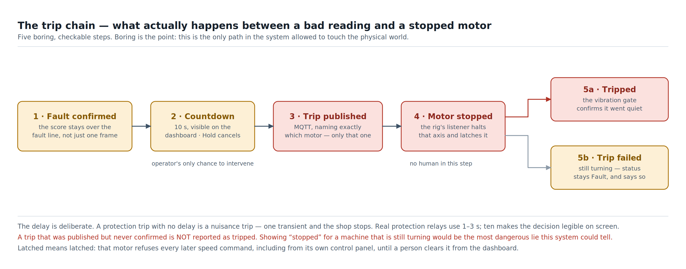

Five steps, each deliberately boring:

1. **Fault confirmed.** The anomaly score has stayed over this machine's own
   fault threshold across consecutive frames, and this asset has a motor armed
   against it. Protection is armed **per asset**, not fleet-wide — most
   monitored points have no actuator at all, and arming one is an explicit
   choice made during setup, and confirmed by really stopping the machine
   ([§5.3](#chapter-5-teaching-it-what-normal-feels-like)).
2. **A ten-second countdown**, visible in a banner at the top of every tab and
   cancellable with a **Hold** button. This is the operator's only chance to
   intervene, and it exists on purpose — see [§8.3](#chapter-8-the-day-it-stopped-itself).
3. **The trip is published** over MQTT, naming exactly which motor. One motor,
   one asset: the dashboard refuses to point two assets at the same motor,
   because a trip from either would then look like it came from both.
4. **The motor stops.** A listener on the rig halts that one axis and latches
   it. The other motors, if healthy, keep running.
5. **Confirmation, or an honest failure.** The vibration gate watches for the
   machine actually going quiet. If it does, the asset becomes **Tripped**. If
   it doesn't, the status stays **Fault** and is explicitly marked as a failed
   trip.

Captured off the real hardware the first time this ran end to end:

```
TRIP RECEIVED: stopping motor 1...
motor 1 stopped
```

## 8.3 Three design decisions that look wrong until you think about them

**The delay.** A protection trip with no delay is a nuisance trip: one transient
and the shop stops. Real machinery-protection relays delay their trips for
exactly this reason — a momentary excursion has to persist to be believed. Ten
seconds is longer than an industrial relay's one-to-three, and that is
deliberate: it is the window in which the decision becomes *legible* to a human,
counting down on a screen, with a button to stop it.

**Latching.** A system that re-arms itself a second later is not a safety
system; it is a very anxious light switch. The stopped motor refuses every later
speed command — including from the rig's own control panel — until a person
clears it from the dashboard. That is what "protection" means as distinct from
"control".

**Refusing to claim success.** If the trip is published but the machine keeps
turning, the system does **not** report it as tripped. It stays in Fault and
says the trip failed, in a red banner that cannot be dismissed. Showing
"stopped" for a machine that is still turning would be the single most dangerous
lie this dashboard could tell, and no amount of "well, we sent the message"
changes that.

There is also a deliberate absence: **there is no "reset protection" button.**
Restarting the machine is what clears things, and restarting makes frames score
again — so the score alone decides where the asset lands. Fix the fault and it
returns to healthy. Don't, and it goes back to fault and trips again. An
operator cannot restart their way out of a real fault, and nothing in this
system ever restarts a machine on its own.

One consequence worth naming, because it was asked about twice and the answer is
one line of code: a machine stopped by the **setup test** in
[§5.3](#chapter-5-teaching-it-what-normal-feels-like) lands on **Idle**, not
Tripped. We stopped a healthy machine on purpose, and recording that as a trip
would leave a fake trip in the machine's history. A fault-driven stop lands on
**Tripped**. The distinction is `target = TRIPPED if was_ours else IDLE`, and it
is the difference between a record you can trust and one you can't.

## 8.4 What this is, and what it is not

This needs saying plainly, in the chapter where the software starts turning
things off.

**This is a condition-monitoring system with a protective trip. It is not a
certified functional-safety system**, and it is not a substitute for one. It has
no safety integrity level, no redundant channel, no independent watchdog on the
trip path, and no fail-safe behaviour if the base station itself loses power —
if the Linux side dies, nothing trips, and the machine keeps running exactly as
it would have without this system installed. That is the correct failure mode
for a *monitoring* device, and it is the wrong one for a guard interlock. Do not
use it as a guard interlock.

What it *is* good for is the failure class it was built for: gradual mechanical
degradation, detected early, acted on before it becomes damage. Every safety
function a machine already has — emergency stop, guarding, overload protection —
stays exactly where it is and answers to nobody in this document.

Three practical notes for anyone building one:

* **The trip stops motion, not power** ([§11.5](#chapter-11-why-we-built-it-this-way)).
  A stopped stepper is still an energised stepper.
* **The bench rig runs at 12–24 V DC with stepper drivers that get genuinely
  hot.** Set each driver's current limit before applying power
  ([Appendix B](#appendix-b-wiring-and-pinout-reference)); an over-current
  driver is a fire risk, not just a dead part.
* **Nothing in this system starts a machine.** That is a hard invariant, stated
  in the protection module's own docstring and enforced by there being no code
  path that could. Restarting is a human action taken at the machine, and the
  moment that stops being true, every argument in this chapter stops holding.

## 8.5 The machine that cried wolf

Building the trip mechanism took a few days. Making it fire *reliably* took
considerably longer, and the reason is worth telling because it is the most
useful engineering in the project.

The first version measured "how energetic is this machine's vibration right
now" as a straight average across the whole spectrum. It worked in early testing
and then quietly stopped being trustworthy: stopped and running machines
measured almost the same — **1.18×** apart in the worst case. That is not a gap
you can safely threshold on, and a gate you cannot trust means a trip that can
never confirm.

The cause turned out to be the sensor, not the machine. An accelerometer
sensitive enough to catch a bearing starting to fail is also sensitive enough to
have a noise floor of its own — a broadband electrical hiss present whether the
machine is on or off — and that noise is spread across most of the spectrum,
while the motor's actual mechanical signature is a handful of narrow lines below
about 600 Hz. We had built a very sophisticated and expensive way of measuring
an accelerometer.

The fix: teach each node what its own sensor reads with the machine
**deliberately off**, fit a per-bin noise floor from those frames, and count only
the *excess* over that floor as real signal. That measurement is step 2 of setup
([§5.2](#chapter-5-teaching-it-what-normal-feels-like)).

| Method | Stopped | Running | Worst-case margin |
|---|---|---|---|
| Full-spectrum average (original) | 7,480 | 11,137 | 1.18× |
| Excess over measured baseline (current) | 1,414 | 6,194 | **2.09×** |

The difference between a threshold that is basically a coin flip and one you can
arm a motor stop against.

Two things make this more than a bug fix. First, the baseline is captured
separately from training and never invalidates an existing model — capturing one
cannot force a retrain, so an operator can re-measure a machine's quiet whenever
the shop changes around it. Second, the principle generalises: **don't hardcode a
number that is supposed to mean "this machine is running". Measure it, per
machine, per sensor.** It is more setup than a constant in a config file, and it
is the difference between something that works on the bench and something that
works on the fortieth machine in a fleet.

The full investigation — including the two reasonable hypotheses that turned out
to be wrong, and two alternative approaches that measured *worse* — is
[Appendix H](#appendix-h-motor-state-gate-calibration).

---
# Part III — The human interface

# Chapter 9. What the operator actually sees

> **Month 11, 06:15.** Ravi opens the shed. Before he has taken his jacket off
> he already knows something happened: the ring on the compressor is blinking
> slow red, and there is a message on his phone from four hours ago. Neither of
> those required him to open a laptop.

## 9.1 Three channels, none depending on the others

Nobody is standing at the machine when the trip happens — that is the entire
point. So the system talks back on three independent channels: a **light on the
machine** for whoever walks past, a **live dashboard** for whoever is checking,
and a **phone alert** for whoever needs to know right now without checking
anything. None of them requires another to be working.

## 9.2 Every status an asset can hold

Ten states, and it is worth walking all of them, because "what is this machine
doing right now" is the question the whole product exists to answer.

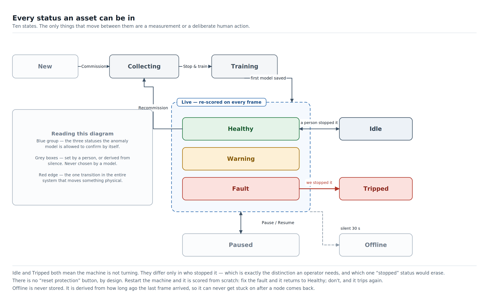

| Status | What it means | Who sets it |
|---|---|---|
| **New** | Streaming data, never set up. No model, nothing to score against. | The system, when an unknown node first appears |
| **Collecting** | Setup in progress; frames are being gathered. The row shows live progress — *Running 41/50*. | An operator working through setup |
| **Training** | The batch is closed and the model is being fitted. The row shows a live percentage. | An operator pressing Train |
| **Healthy** | Scored, and comfortably below this machine's own warning line. | The anomaly model |
| **Warning** | Over the warning line. Something has changed; nothing has been decided. | The anomaly model |
| **Fault** | Over the fault line, sustained. If a motor is armed, this is what starts the countdown. | The anomaly model |
| **Idle** | The machine is not turning, and *a person* stopped it. Normal, not a problem. | The running/stopped gate |
| **Tripped** | The machine is not turning, and *we* stopped it. Latched until cleared. | Machinery protection, only after the gate confirms it actually went quiet |
| **Paused** | An operator has deliberately suspended monitoring — maintenance, a known noisy job. Staleness never demotes it to Offline, because it is a standing human intent. | An operator |
| **Offline** | Nothing heard for 30 seconds. **Never stored** — derived from the last frame's timestamp, so it can never get stuck on after a node comes back. | Derived, continuously |

Two of these deserve their own sentence.

**Idle and Tripped are separate on purpose.** Both mean "not turning".
Collapsing them into one *stopped* status would erase the only distinction an
operator actually cares about: whether this was expected. "It's not moving" is
not a diagnosis.

**Idle also closed a real hole.** The gate could already detect a stopped motor
and inference already declined to score one — but nothing ever wrote that fact
anywhere, so a machine switched off an hour ago kept displaying whatever status
it held while it was last running.

Every legal transition between these states is enforced in one place by an
explicit state machine, rather than by each feature setting a status field and
hoping. That is not tidiness for its own sake: it closed a real bug where
pausing a node mid-setup silently stole it out from under the setup session.

## 9.3 The trip banner — the one thing that is never behind a click

Everything else in this chapter is somewhere you have to navigate to. The trip
banner is not.

It sits **above the tab bar**, so it is on screen on Fleet, Classifier, Network,
Performance and Alerts alike, and it carries one line per affected asset:

| Kind | What it says | Can you dismiss it? |
|---|---|---|
| Countdown | *Pump 1 — tripping in 8s* · with a **Hold** button | No. It is still true and still needs a decision |
| Trip failed | *Pump 1 — trip failed, machine still running* | **No.** The most severe thing this system can report |
| Tripped | *Tripped — Pump 1 at 02:40, confirmed stopped* | Yes — the event is settled |
| Faulty, unarmed | *Drill press — faulty, no trip output wired* | Yes, quieter, and no Hold, because there is nothing to hold |

The countdown and the Hold button used to live inside the Protection section of
an expanded asset row. Ten seconds is not enough time to remember which asset it
was, find its row, expand it and scroll. The rule the dashboard now follows is
**cold configuration in the drawer, hot state out front**: a trip countdown is
an alarm, not a setting.

A dismissed line comes back if the asset's situation changes again, so one
acknowledgement never silences a machine permanently. And the seconds tick in
place twice a second without re-rendering the banner, so the Hold button is
never yanked out from under a finger mid-tap.

> **[SCREENSHOT: the trip banner mid-countdown, with the Hold button, on the Performance tab — to show it follows you across tabs]**

## 9.4 Five tabs, five questions

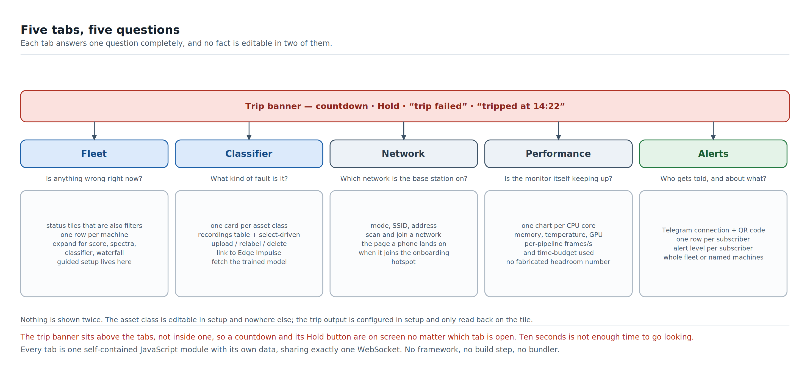

Each tab answers one question completely, and — a rule held throughout — **no
fact is editable in two places**. The asset class is edited in setup and nowhere
else. The trip output is configured in setup and only read back on the tile.

## 9.5 Fleet — *is anything wrong right now?*

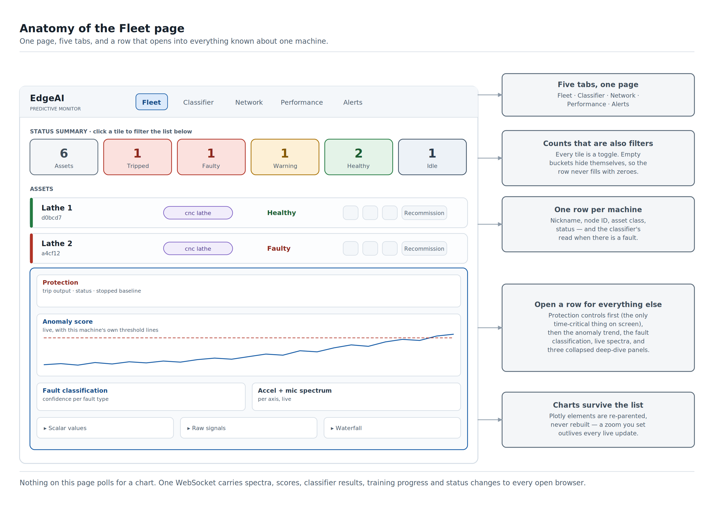

**The status summary row.** One tile per status, each showing a count — and each
tile is also a **filter**. Click *Faulty* and the list below shows only faulty
machines; click again to bring them back; click several to combine. Two details
that came out of using it rather than designing it:

* Tiles with a count of zero **hide themselves**, so a healthy fleet shows a
  short, calm row instead of a wall of zeroes. They reappear in their original
  fixed position when the count comes back, never appended wherever they
  happened to change.
* The *Assets* (select-all) tile only appears when there are at least two
  non-empty buckets to select across. With one bucket it would just duplicate
  that bucket's own count and its own button.

**One row per asset.** Compact by design: nickname, node ID, asset class,
status. The node ID is always shown underneath the name, so identity is never
ambiguous even after somebody names two machines "Lathe". The asset-class pill
is colour-keyed and links back to setup rather than offering a second live
editor for the same value.

When a machine is in warning or fault **and** a classifier has actually scored
it, a second chip appears next to the status carrying the fault name. It is
deliberately its own chip in its own colour rather than folded into the status
pill, because the classifier is an independent signal that is allowed to
disagree with the status.

The row's controls change with the status rather than greying out generically —
*Set up* becomes *Train* when enough frames are collected, becomes *Training…*
while fitting, becomes *Re-run setup* afterwards. On a stopped machine it is
disabled with a reason that says what to do about it: *"Start the machine first."*
An armed asset carries a small shield glyph — no text, no second copy of the
status string.

**Open a row and you get everything known about that machine**, in a deliberate
order:

1. **Protection**, at the top — which motor is armed, whether the mapping was
   confirmed and when, and the trip state. It is read-only here; the controls
   live in setup. It is first because during an incident it is the most
   important thing on the screen.
2. **Anomaly score**, live, with this machine's own threshold lines drawn on it
   and a scrubber for the last half hour. It is hidden entirely for a machine
   with no model yet — an empty chart is worse than no chart, and showing the
   *old* trend during a re-setup would be stale data masquerading as current.
3. **Fault classification** — confidence per fault type, shown only once a model
   has actually scored this machine.
4. **Live spectra**, accelerometer per axis and microphone.
5. Three collapsed panels for going deeper: **Scalar values** (all 24
   statistics), **Raw signals** (time domain), and **Waterfall** — a spectrogram
   over time, in either a 2D heatmap or a 3D ridgeline.

The heavy panels are not just hidden when collapsed, they are **not rendered at
all** until first opened, which keeps opening a row cheap even on a phone.

> **[SCREENSHOT: an expanded asset row with the anomaly chart, classifier bars and spectra visible]**

## 9.6 Classifier — *what kind of fault is it?*

One card per asset class, each one self-contained, because a class is the unit
everything on this tab operates on.

Inside a card, top to bottom:

* **The link row.** Either a *Link to Edge Impulse* button, or — once linked —
  the project's name as a direct link into Edge Impulse Studio, plus *Unlink*.
  There is no separate "linked ✓" badge, because the row itself already is the
  link state.
* **The recordings table.** Every capture for this class: which node it came
  from, its label, when it was taken, how many frames. Row checkboxes drive
  everything.
* **One action bar, driven by that selection** — *Upload (N)*, *Edit label (N)*,
  *Delete (N)*. There are deliberately no per-row pencil and trash icons: one
  selection mechanism for all three actions, matching the pattern Edge Impulse's
  own sample table uses rather than inventing a different one next to it.
* **The model row** — *Fetch trained model*, and when the last fetch happened.
  While a job runs it becomes a live progress readout, and it survives a page
  refresh because the job state is on the server.

**Orphaned classes are not hidden.** If every node of a class is decommissioned,
its recordings still exist, and they get their own de-emphasised, delete-only
card. Making a card vanish and silently taking its data with it is how people
lose four hours of labelled captures.

> **[SCREENSHOT: the Classifier tab with two asset-class cards, one linked with recordings selected]**

## 9.7 Network — *which network is the base station on?*

The smallest tab, and the one that saves the most swearing.

* **Current state** — mode (connected / access point / disconnected), the
  network name, and the address. That address is what you type into a phone to
  reach the dashboard, so it is shown plainly rather than buried.
* **Join a network** — a scan, the results as a list of tappable buttons, and a
  password field.

This is the page a phone lands on when it joins the base station's onboarding
hotspot ([§4.2](#chapter-4-growing-the-fleet)) — the captive portal redirects
straight here. That is the reason for two decisions that look odd in isolation:
the network list is buttons rather than a native autocomplete (mobile browsers
render `<datalist>` unreliably or not at all), and the *"this page may close when
you tap Connect — that's normal"* warning is placed **above** the button,
because the page is gone before anyone could read it underneath.

There is no live push on this tab. Wi-Fi state changes rarely, and almost always
in response to this tab's own action, so it fetches on activation and after a
connect attempt. A WebSocket feed here would be machinery in service of nothing.

## 9.8 Performance — *is the monitor itself keeping up?*

For when *the monitor* feels slow rather than a machine feeling wrong. Two
tiers, both live time-plots — no gauges, no static cells, nothing hidden behind
an "Advanced" disclosure.

**Tier 1 — the QRB2210 itself.**

* **One chart per CPU core**, not one averaged number. This pipeline has
  single-threaded stretches, and an average would happily hide one core pinned
  at 100% behind three idle ones.
* Memory, and temperature where the board exposes a thermal zone.
* GPU utilisation where the GPU bridge is provisioned.
* Metrics that aren't genuinely available are **left out**, not faked and not
  shown as zero. A missing thermal zone means no temperature chart, and that is
  the correct behaviour.

**Tier 2 — the pipelines.** One row per live asset:

* **Frames arriving per second** — is this node actually feeding us?
* **Percentage of its time budget used** — average processing latency against
  the frame period. This is the honest headroom signal, and it is deliberately
  not dressed up as a fabricated *"you could add 6 more nodes"* estimate, which
  would be a guess wearing a number's clothes.

Both tiers re-render only their contents, never their container, so a collapsed
tier stays collapsed and a chart you were reading doesn't jump.

One practical finding lives behind this tab and is worth passing on: reading
temperatures through the obvious Python system-monitoring call took **8–10
seconds per call** on this board, which is not a metric, it is an outage. It
reads the kernel's thermal-zone files directly instead.

> **[SCREENSHOT: the Performance tab, per-core charts visible]**

## 9.9 Alerts — *who gets told, and about what?*

* **Connect Telegram.** A QR code and a deep link. Scan it with a phone, tap
  start, and that phone is a subscriber — no account, no invite code typed by
  hand, no bot username to remember. The link carries a one-time token with a
  fifteen-minute life, so an old screenshot of the QR code is not a permanent
  key to the fleet's alerts.
* **One row per subscriber**, with two preferences each:
  * **Level** — everything from warnings upward, or faults only.
  * **Scope** — the whole fleet, or a named set of machines. The shift
    supervisor wants all of it; the person who only looks after the compressors
    does not.
* If no bot token is configured, the tab says exactly that and what to do about
  it, rather than showing a dead Connect button.

> **[SCREENSHOT: the Alerts tab with the QR code and one connected subscriber]**

## 9.10 The light on the machine

Every base station and every satellite node carries its own status ring, and the
colour alone tells the story from across the room:

| State | Ring |
|---|---|
| New | Cyan, steady |
| Healthy | Green, steady |
| Warning | Amber, slow breathing pulse |
| Fault | Red, fast strobe |
| Tripped | Red, **slow** strobe — deliberate rather than urgent: *I already acted* |
| Idle | Magenta, steady |
| Paused | Mid grey |
| Offline | Dark grey |

The colours are hand-tuned for real WS2812 LEDs and are **not** copied from the
dashboard's palette, because that was tried and looked wrong. On an uncorrected
WS2812 any weak secondary channel shows up disproportionately, so a
screen-friendly emerald rendered visibly bluish and a screen-friendly red
rendered pink. Near-primary values avoid that.

Idle is the one status where the ring and the screen share an exact value —
`#ff00ff` in both — because a magenta ring and a magenta tile should read as one
status. It got there the hard way: idle was pure blue until a bench test showed
it was indistinguishable from the cyan used for *new*, which is a genuinely bad
pair of meanings to confuse. Magenta is a full-strength two-channel mix, so it
obeys the near-primary rule, and no machine has ever been accused of being
magenta by accident.

Tripped reuses fault's red and differs only in strobe period — 200 ms reads as
an alarm, 1000 ms as a latched decision. That is deliberately not a new blink
mode: const, breathe and strobe is the entire vocabulary the wire protocol and
every node's firmware understand, so inventing a fourth would mean reflashing
every node in the shop to change one light.

The base station adds a readout most sensor nodes don't have: the **8×13 LED
matrix already on the board**, scrolling a one-line fleet summary — counts only,
worst first. `FFLT,WWRN,OOFF,HOK` reads as *1 fault, 1 warning, 1 offline, the
rest healthy*. Idle and Paused are excluded from it entirely, because that
display exists to answer one question — *is anything wrong* — and a machine
somebody switched off is not.

> **[PHOTO: the status ring in each colour state, and the LED matrix mid-scroll]**

## 9.11 The phone alert

The dashboard runs a Telegram bot: link a phone once — by scanning the QR code
on the Alerts tab — and a confirmed fault arrives as a message carrying the
machine's nickname and, when there is one, the classifier's read. Nobody has to
go looking.

This was built and demonstrated working against a real Telegram bot and a real
phone. It is switched off in the current build for one reason only: the bot
token is a managed App Lab secret that has to be re-entered through App Lab's
interface after some device-testing housekeeping, and the on-device build fails
if the brick is declared with no value behind it. Nothing about the feature is
unfinished; a value is missing.

> **[SCREENSHOT: a real Telegram fault alert]**

---
# Part IV — The engineering

# Chapter 10. Under the hood

## 10.1 Three kinds of board, one brain

Everything in this report runs on three kinds of hardware: the base station, one
or more satellite nodes, and the motor-driver rig. **Only one of them thinks.**

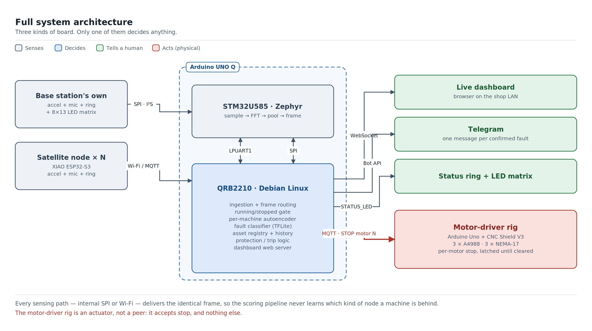

The base station's Linux side is where the asset registry lives, where models
train and run, where the dashboard is served, and where the decision to stop a
motor is made. Every other board is a sense organ or a muscle. The motor-driver
rig in particular is not a peer — it accepts *stop*, and nothing else. There is
no code path in this system that can set a speed or start a machine.

## 10.2 The software, layer by layer

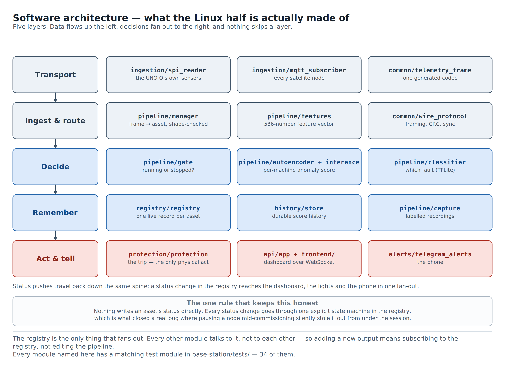

Roughly 13,000 lines of Python on the Linux side, 8,000 lines of frontend, 4,300
of Zephyr firmware, 2,800 of ESP32 firmware and 8,900 lines of tests. It is
organised as five layers, and nothing skips a layer.

| Layer | Modules | What it is responsible for |
|---|---|---|
| **Transport** | `ingestion/spi_reader`, `ingestion/mqtt_subscriber`, `common/telemetry_frame` | Getting bytes off a wire and turning them into a frame. Two sources, one frame type |
| **Ingest & route** | `pipeline/manager`, `pipeline/features`, `common/wire_protocol` | Matching a frame to an asset, validating its shape, building the 536-number feature vector |
| **Decide** | `pipeline/gate`, `pipeline/autoencoder` + `inference`, `pipeline/classifier` | Running or stopped? How unlike normal? Which fault? |
| **Remember** | `registry/registry`, `history/store`, `pipeline/capture` | One live record per asset, durable score history, labelled recordings |
| **Act & tell** | `protection/protection`, `api/app` + `frontend/`, `alerts/telegram_alerts` | The trip, the dashboard, the phone |

**The registry is the only thing that fans out.** Nothing writes an asset's
status directly and nothing subscribes to the pipeline. A status change goes
into the registry through one explicit state machine, and the registry pushes it
to everything downstream at once — dashboard, status ring, LED matrix, Telegram,
and where applicable, protection. Adding a new output to this system means
subscribing to the registry, not editing the scoring path. That is worth more
than it sounds: the scoring path is the one place a mistake produces a wrong
answer about a machine.

Each layer's modules have a matching test module — 34 of them, listed in
[Appendix J](#appendix-j-test-suite-and-verification-record).

## 10.3 One frame, start to finish

1. **Acquire.** The accelerometer and microphone are sampled at their native
   rates on whichever chip they are wired to. The accelerometer's hardware FIFO
   batches samples so the host gets one interrupt per block rather than one per
   sample.
2. **Reduce.** That same chip runs a 512-point FFT per channel, computes the six
   statistics per channel, then average-pools each spectrum down to its 128-bin
   wire count. This step is what makes the whole architecture possible: shipping
   raw audio and vibration off-chip at native rate would saturate any link fast
   enough to be worth having.
3. **Arrive.** The frame reaches the Linux side — over the internal SPI bus for
   the base station's own sensors (~10–14.5 KB every 64 ms), or over Wi-Fi/MQTT
   from a satellite (~4.1 KB every 200 ms). Same frame either way.
4. **Route.** The pipeline manager matches the frame to an asset, and validates
   its shape against what that asset was set up with. A node whose channel set or
   bin count has changed is caught here rather than silently scored against a
   model that no longer fits it.
5. **Score.** The features feed both the running/stopped gate and the
   autoencoder, and — if this asset's class has a model — the fault classifier.
6. **Fan out.** A status change updates the registry, which pushes to
   everything downstream at once: the dashboard over a WebSocket, the status
   ring and matrix, a Telegram message if one is due, and — on a confirmed fault
   with a motor armed — the trip.

Time-domain sections don't ride every frame. They piggyback on **every fourth**
one, because the collapsed raw-signal charts don't need per-frame freshness and
carrying them every time would drag the whole frame's transfer — and therefore
the anomaly score and the spectra — down with it. The fast path stays fast.

## 10.4 The two internal links, and why they are separate

Between the STM32U585 and the QRB2210 run two independent links:

| Link | Carries | Rate |
|---|---|---|
| **LPUART1** | Control-plane RPC: status pushes, statistics queries, display commands | 500 kbaud |
| **Dedicated SPI** | Bulk telemetry: full-resolution spectra, raw diagnostic pulls | ~40 MHz achieved |

They started as one link. Moving bulk data onto its own bus was not an
optimisation, it was a fix: at ~65 KB/s of continuous frames the shared serial
link's message framer wedged, taking the entire control channel with it. The
current split means a large raw capture — a research operation that pulls
un-decimated time-domain windows — cannot interfere with the live status loop,
because they are not on the same wire.

The UART's own speed has a story too, told in
[Chapter 2](#chapter-2-why-the-arduino-uno-q): 500000 baud is not a round number
picked for comfort, it is the highest rate whose clock divisor leaves enough
sampling margin to survive a real soak test.

## 10.5 What runs as what

Worth setting out plainly, because "it's a Linux board" hides a real deployment
shape.

| Piece | Where it runs | Notes |
|---|---|---|
| **The application** | An App Lab container on the QRB2210 | One process: FastAPI, the WebSocket, ingestion threads, the pipelines, protection, alerts. The dashboard is on port 8080 |
| **The Zephyr sketch** | The STM32U585 | Flashed from App Lab. Sampling, FFTs, both displays |
| **SPI bridge** | A small host-side service outside the container | The container's device allowlist does not include the SPI major, so the bulk link is brokered over a Unix socket |
| **Wi-Fi bridge** | Host-side service | Scanning and joining a network needs privileges the container correctly does not have |
| **GPU bridge** | Host-side service, optional | Only for the Performance tab's GPU chart. Absent means no chart, not a fake one |
| **MQTT broker** | Mosquitto on the board itself | Satellites are sensors — they need somewhere to publish that is not a laptop |

The broker running **on the UNO Q** rather than on a developer machine is a
deliberate and load-bearing choice. A satellite node bolted to a compressor has
nowhere else to send its data; if the broker lives on somebody's laptop, the
fleet stops the moment that laptop closes.

## 10.6 What is stored where

Everything durable lives under one data directory, which is a bind mount outside
the container's own writable layer — so a redeploy replaces the code and never
the history.

| File | What it holds | Notes |
|---|---|---|
| `registry.json` | Every known asset: name, class, thresholds, trip mapping, sensor config | The durable half of the registry. Live per-frame values are held in memory — see [§10.8](#chapter-10-under-the-hood) |
| `history.db` | Anomaly score history per asset | SQLite. What a future severity-trend feature would read |
| `models/<node>.pt` | One trained autoencoder per machine | PyTorch |
| `ei_models/<class>.tflite` | One fetched fault classifier per asset class | Plus its label list |
| `ei_projects.json` | Asset class → Edge Impulse project and scoped API key | Written **`0600`**. The only persisted secret typed into the dashboard |
| `ei_scaling.json` | Pooled per-class normalisation baseline | What keeps training and serving on the same scale ([§7.5](#chapter-7-training-the-classifier-with-edge-impulse)) |
| `captures/` | Labelled recordings, one file per capture | Including every condition collected during setup |
| `alerts.json` | Telegram subscribers and their preferences | |

There is exactly one thing in this list that is a secret, and it is the one file
with tighter permissions than the rest. Edge Impulse credentials used to *create*
a project are never written anywhere at all — they live in memory for the
duration of one call.

## 10.7 One threading pattern, used everywhere

Every sampling thread in this codebase — accelerometer, microphone, on either
chip — follows the same shape: **sample continuously in its own thread, publish
only the latest result behind a lock, and let the consumer read that latest
value whenever it is ready.** No queues, no backlog.

It is a small, boring pattern applied consistently on purpose. A monitoring
system that falls behind should skip forward to *now*, not spend its time
catching up on a machine's past. There is nothing actionable in a spectrum from
four seconds ago.

Thread priorities on the real-time side are all declared in one file rather than
scattered across six, for a blunt reason: priority mistakes were this project's
two worst hardware bugs. A busy-polling microphone thread once starved the
inter-processor link so thoroughly that it died silently with no error anywhere,
and two threads sharing a priority level meant one could sit ready for a full
scheduler timeslice waiting out the other. Both are now impossible to
reintroduce by accident, because every value is in one place where they can be
read together.

On the Linux side, anything that takes real time runs on a background thread and
streams progress over the WebSocket rather than blocking a request: training,
uploading to Edge Impulse, fetching a model. All three report their state
through an endpoint as well as through the socket, so refreshing the page
mid-job shows the job, not a blank card.

## 10.8 The things that keep the dashboard honest

Four details that are invisible when they work and very visible when they don't.

* **The registry does not write to disk on every frame.** It used to. Every
  ingested frame rewrote the whole asset file while holding that asset's lock —
  the same lock every dashboard action waits on — so a single storage hiccup
  froze the entire UI: ingestion stalled inside the lock, requests piled up
  behind it, live pushes stopped, and the node eventually read as offline. Live
  values that are refreshed several times a second are now held in memory; the
  durable history is a separate database write.
* **Charts are re-parented, never rebuilt.** The asset list rebuilds itself on
  every update. If the chart elements lived inside that markup, every zoom or
  pan an operator applied would be wiped several times a minute. Instead the
  chart elements are created once and moved into whatever slot the newest render
  produced.
* **The inference pipeline is rebuilt when its inputs change.** Re-running setup
  on a machine, or resuming a paused one, used to leave a cached pipeline holding
  the old thresholds and the old model — so a machine could sit reading
  *healthy* while its own graph was red. Both were real bugs, both are fixed,
  and both are now covered by tests.
* **The setup drawer is outside the list that re-renders.** The fleet list
  refreshes on a five-second poll. A wizard whose text fields live inside that
  markup would blank a half-typed machine name every five seconds, which is the
  kind of defect that makes people stop using a tool without ever filing a bug
  about it.

One more, from the same family, because it cost a live debugging session: when a
new WebSocket message type is added, it has to be added to the **dispatcher** as
well as the handler. The setup and trip-confirmation messages were handled
correctly and forwarded by nothing, so the drawer sat on *"Stopping output 1 —
watch the machine…"* forever while the backend had long since finished. That
class of bug only appears against real hardware, which is why the verification
record in [Appendix J](#appendix-j-test-suite-and-verification-record) matters
as much as the test list.

---

# Chapter 11. Why we built it this way

Ten decisions, the alternative in each case, and what it cost.

## 11.1 A wired serial link between the two chips, not a second SPI bus

The chip-to-chip control link was nearly a second SPI bus with the Linux side as
master. The Qualcomm SPI hardware only really supports master mode on Linux, so
the STM32 would have had to be a slave — which meant fragile DMA timing above
modest clock rates, plus an extra signal wire purely to tell the master a frame
was ready. A bidirectional serial link needs none of that: either side talks
whenever it has something to say. Less clever, considerably more robust.

## 11.2 Train each machine's model on the machine

Covered in [§5.10](#chapter-5-teaching-it-what-normal-feels-like). The
alternative — capture, ship to a cloud service, wait, deploy back — works, and
turns a five-minute walk-up task into a workflow with a network dependency, a
queue and a data-governance question.

## 11.3 An unsupervised detector, with a supervised classifier alongside

The primary detector had to work on a machine that has never failed, because
that is every machine at the moment it is installed. That rules out a supervised
model as the *primary* signal. The classifier then adds the "what" once labelled
data exists, without ever becoming a dependency of the safety path
([§6.3](#chapter-6-naming-the-fault)).

## 11.4 Per-machine anomaly model, per-type classifier — and whether that has to stay true

This asymmetry is a fair thing to question, and it is worth answering properly:
*if identical machines can share a classifier, why can't they share an
autoencoder?*

**Why it is per-machine today.** The autoencoder models "normal for this unit",
and its output is a reconstruction error measured in units set by that unit's own
spectrum. Two nominally identical lathes differ in mounting stiffness, sensor
placement, foundation, load and wear. Sharing weights would mean sharing a score
scale, and the thresholds ([§5.7](#chapter-5-teaching-it-what-normal-feels-like))
are absolute distances in that scale.

**Why it probably doesn't have to stay that way.** The inputs are already
substantially unit-normalised before the model ever sees them: spectra are
peak-normalised per frame, and the six statistics per channel are standardised
using per-node statistics fitted at setup. Much of the unit-to-unit offset is
therefore already removed. The remaining blockers are narrower than they first
look — the input dimension has to match across units (same channel set and bin
count), and the thresholds are per-node.

**The version that would work.** Pre-train one autoencoder per *asset class* on
pooled healthy data from every unit of that class, then, for each new unit,
collect a short healthy batch and use it only to fit that unit's normalisation
statistics and thresholds — not to retrain the weights. Setting up a new machine
would drop from "collect and train" to "collect and calibrate", and the shared
model would be better than any single machine's, because it would have seen more
genuinely healthy variation.

This is **not built**, and it was explicitly deferred rather than forgotten. The
reason is measurement discipline: it adds a shared mutable artefact to the path
that decides FAULT, and with one rig there is no second same-class machine to
measure the benefit against. Building it would mean trusting an argument instead
of a number, which is exactly the habit the rest of this project was built to
avoid. It is on the roadmap in [Chapter 13](#chapter-13-whats-next) as a scoped
item with a stated precondition.

## 11.5 A software-latched stop today, a relay later

The honest version: a relay per motor, wired to physically break the power line,
is the more bulletproof long-term design. What exists today is a per-motor
command that halts motion and refuses to re-arm until cleared. It was chosen
because it is real, testable on hardware already in hand, and does not require
sourcing new parts against a fixed deadline. It genuinely stops the motor from
turning; it is not yet the belt-and-braces version that also removes electrical
power at the source. [Chapter 13](#chapter-13-whats-next) has it first on the
list.

## 11.6 One wire format, wired or wireless

Base-station sensors and satellite nodes could easily have grown two data
shapes. They didn't — and the format is generated for all three codebases from a
single schema file, so the base station, the ingestion parser and the satellite
firmware cannot silently drift apart. Changing the format means regenerating,
not remembering. ([Appendix F](#appendix-f-wire-protocol-specification).)

## 11.7 Measure each machine's own quiet

[Chapter 8](#chapter-8-the-day-it-stopped-itself) tells the story. The principle
that came out of it is broader than the fix: don't hardcode a number that is
supposed to mean "this machine is running". Measure it, per machine, per sensor,
and compare against that.

## 11.8 Prove the actuator mapping instead of asking for it

The old motor dropdown was a guess dressed as a configuration field, and its
correctness was tested for the first time during the first real fault. Sending a
real stop and watching the machine go quiet ([§5.3](#chapter-5-teaching-it-what-normal-feels-like))
costs one extra minute at setup and converts the single most consequential piece
of wiring knowledge in the system from *remembered* to *verified*. It is also
the only design in this project that got simpler and safer at the same time.

## 11.9 A mature platform for the second model

Building a training pipeline for the fault classifier from scratch was on the
table. Edge Impulse — built for exactly this category of sensor ML — was chosen
instead, so effort could go into the parts nothing provides off the shelf: the
gate, the trip, the fleet dashboard. It also keeps that model structurally
independent of the safety path ([Chapter 7](#chapter-7-training-the-classifier-with-edge-impulse)).

## 11.10 Statuses that distinguish *who* did something

Idle versus Tripped, Paused versus Offline. In each pair, both statuses mean
roughly the same thing physically and completely different things
operationally. Collapsing either pair would make the dashboard shorter and
strictly less useful. ([§9.2](#chapter-9-what-the-operator-actually-sees).)

---

# Chapter 12. Proof, not promises

## 12.1 What "verified" means here

Every number in this chapter was measured on the real rig — sensors reading a
spinning motor, a trip actually stopping that motor, a dashboard checked against
a live device in a real browser. Where a figure appears, it came out of that
hardware. [Appendix J](#appendix-j-test-suite-and-verification-record) records
how each was checked.

> **[SCREENSHOT: the dashboard mid-trip — status, countdown, anomaly chart and console log together]**

## 12.2 The gate, measured

Per-bin accelerometer energy, sensor stationary versus the rig spinning at
90 RPM:

| Frequency bin | Stopped | Running | Delta |
|---|---|---|---|
| ~131 Hz | 13,192 | 36,134 | **+22,942** |
| ~281 Hz | 12,680 | 44,798 | **+32,118** |
| ~381 Hz | 13,586 | 40,638 | **+27,052** |
| ~631 Hz | 13,453 | 13,545 | +92 |
| ~1,231 Hz | 11,217 | 11,482 | +265 |
| ~3,231 Hz | 5,525 | 5,483 | −42 |

The motor's entire mechanical signature is a handful of narrow lines below about
600 Hz — the stepper's own step rate, 90 RPM × 200 full steps = 300 Hz, landing
squarely in those bins. Everything above is the accelerometer's own broadband
noise, present identically whether the machine runs or not.

Which is why the metric had to change:

| Method | Stopped | Running | Worst-case margin |
|---|---|---|---|
| Full-spectrum average | 7,480 | 11,137 | 1.18× |
| Excess over measured baseline | 1,414 | 6,194 | **2.09×** |

## 12.3 A real setup run

Numbers straight off one session:

* Stopped baseline: **65 frames** captured with the rig confirmed physically
  off, fitted energy reference **1,533.1**, measured spread **1.39×**, gate
  threshold set at **2,682.9**.
* The node went from flapping between fault and warning at rest to settling
  cleanly on **Idle**.
* Spun the rig back up: it left Idle immediately.
* Trained against the running rig: healthy anomaly score **0.046** against a
  warning threshold of **0.144** and a fault threshold of **0.288** — a machine
  confidently reading as itself, with real daylight between normal and the line
  that means trouble.
* Ramped down again: returned cleanly to Idle, not to Fault.
* Dashboard checked against the live device in a real browser, zero console
  errors throughout.

A second session, the full six-step flow end to end on the real UNO Q and rig:
the rig's output announcement arriving and populating the step; the
confirm-by-stopping test passing against the correct output, correctly failing
against a wrong one, and correctly refusing to run against an already-stopped
machine; a stopped baseline taken with the machine genuinely off; two named
running conditions each collecting their own frames; and all four trip-banner
states — countdown with Hold, tripped, trip-failed, and faulty-but-unarmed —
rendered on all five tabs with no JavaScript errors.

## 12.4 The trip, both directions

Verified repeatedly on the rig, not once:

* Motor spinning → fault confirmed → countdown → **motor stops**, stays
  stopped, and refuses further speed commands until cleared from the dashboard.
* Cleared and spun back up → resumes normally, re-scored from scratch.

Both the confirmation test in setup and a genuine fault-driven trip were
observed against the same output minutes apart in one session — the first
landing on Idle, the second on Tripped, exactly as intended.

One honest observation from that run, recorded because it is a real
characteristic rather than a defect: the countdown started and was cancelled
three times before the trip finally fired, because the score was bouncing right
at the fault threshold. The system behaved correctly every time — a fault has to
persist to be believed — but a score sitting on the line produces a visibly
twitchy banner, and threshold hysteresis is a fair thing to add.

An earlier version also had a genuine race in how a trip was confirmed, which
could produce a false negative — a trip that had actually worked being reported
as failed. It was found on hardware, fixed, and re-tested in both directions.

## 12.5 Feature-representation results

Not every result came from the rig; the offline experiment harness replays real
captures through the whole feature pipeline and sweeps its parameters. Two
findings from it changed the design:

* **Per-axis beats fused,** decisively: +38.5σ worst-case fault separation
  versus +1.8σ for a combined tri-axial magnitude, on the same captures. This is
  why the model consumes `accel_x/y/z` separately.
* **The six statistics carry more than expected.** Adding them took
  healthy-versus-imbalance separation from roughly 3σ to roughly 80σ. A spectrum
  alone was leaving a great deal on the table.

## 12.6 The measured cost of multi-condition training

Repeated here from [§5.6](#chapter-5-teaching-it-what-normal-feels-like) because
it belongs in the results chapter as much as in the design one:

| Training conditions | Warning | Fault | Detected a 2.4× overspeed? |
|---|---:|---:|---|
| One condition (`slow_90rpm`) | 0.146 | 0.292 | Yes — scored 1.851, tripped in ~11 s |
| Two conditions (+ `fast_150rpm`) | 0.745 | 1.490 | **No** — never crossed the threshold |

Pooling conditions widened the healthy spread **5.1×**. The feature is real and
useful; so is the cost, and per-condition thresholds are the open question.

## 12.7 Known limitations, stated plainly

* **The test rig's three motors share one vibration sensor.** Trip one motor
  while the others keep running and that shared sensor still reads *running* —
  because it is honestly still feeling the other two. This is a property of one
  sensor covering three motors on a bench rig, not a software defect; a real
  deployment has one sensor per machine. The rig therefore starts with a
  **single** motor installed, which is both the honest configuration for one
  sensor and the order a real floor grows in; the others are added on the
  control page when the point is fleet scale rather than trip fidelity.
* **Multi-condition training costs sensitivity** ([§12.6](#chapter-12-proof-not-promises)),
  by a measured 5.1× on this rig.
* **A score sitting exactly on the fault threshold makes the countdown flap**
  ([§12.4](#chapter-12-proof-not-promises)). Correct behaviour, unpleasant to
  watch, and fixable with hysteresis.
* **The classifier is not the safety path**, by construction
  ([§6.3](#chapter-6-naming-the-fault)). If it names the wrong fault, the machine
  still stops — the label is just wrong.
* **The trip stops motion, not power.** See
  [§11.5](#chapter-11-why-we-built-it-this-way).
* **Faults above roughly bin 24 look alike on this rig.** A direct consequence
  of [§12.2](#chapter-12-proof-not-promises): above the motor's own signature,
  every class is looking at the same sensor noise. On a machine with genuine
  high-frequency fault content — which the sensor can see, see
  [Appendix G](#appendix-g-sensor-configuration-envelope) — this constraint
  lifts.
* **Satellite nodes are built and decode-verified but have not yet been run on a
  physical XIAO ESP32-S3.** Everything in [Chapter 4](#chapter-4-growing-the-fleet)
  is implemented and exercised through the node simulator against the real base
  station; the hardware bring-up is the outstanding item.

## 12.8 Status ledger

| Subsystem | Status |
|---|---|
| Base-station sensing (vibration + audio) | Live-verified on hardware |
| Guided six-step setup, end to end | Live-verified on hardware |
| Per-machine anomaly model and thresholds | Live-verified on hardware |
| Multi-condition training | Live-verified on hardware, with a measured sensitivity cost |
| Running/stopped gate with measured baseline | Live-verified on hardware |
| Trip-output mapping confirmed by stopping the machine | Live-verified on hardware, including the failure cases |
| Physical trip: per-motor stop + latch + confirm | Live-verified on hardware, both directions |
| Global trip banner, all four states | Live-verified on hardware, all five tabs |
| Dashboard: fleet, detail, setup, protection | Live-verified on hardware |
| Status ring + LED matrix | Live-verified on hardware |
| Wi-Fi onboarding, base station (captive portal) | Live-verified on real phones, three rounds |
| Fault classifier, on-device | Built, running on-device, trained on 541 real captures |
| Edge Impulse link / upload / fetch | Built and exercised against a real Edge Impulse account |
| Satellite sensor nodes | Built; no physical hardware run yet |
| Telegram alerts | Built and demonstrated; off pending one config value |
| Per-motor relay | Not built — [Chapter 13](#chapter-13-whats-next) |
| Automated test suite | 34 test modules, run on every change — [Appendix J](#appendix-j-test-suite-and-verification-record) |

---

# Chapter 13. What's next

In the order they would be built.

**1. A relay per motor.** Today's trip stops a motor from moving; a relay would
remove its power at the source as well. Held back by a no-new-hardware
constraint during this build window, not by any design uncertainty — the trip
message, the latch and the confirmation logic are all already in place and would
not change.

**2. Hysteresis on the fault threshold.** [§12.4](#chapter-12-proof-not-promises)
recorded a countdown starting and cancelling three times before a real trip
fired. The behaviour is correct and the display is alarming; separating the
"enter fault" and "leave fault" levels fixes it without weakening the trip.

**3. Per-condition thresholds.** The 5.1× sensitivity cost measured in
[§12.6](#chapter-12-proof-not-promises) is the single largest known weakness in
the detection path. The hard part is not the thresholds, it is knowing which
condition a machine is currently in — which nothing detects today, and which the
same gate machinery is well placed to answer.

**4. Satellite hardware bring-up.** The firmware is built and decode-verified;
what remains is running it on a physical XIAO ESP32-S3 with real sensors on a
real machine, and closing the one gap in this report's verification record.

**5. A shared anomaly model per asset class.** The scoped version from
[§11.4](#chapter-11-why-we-built-it-this-way): pre-train one autoencoder per
asset class on pooled healthy data, and reduce per-unit setup from "collect and
train" to "collect and calibrate". This makes commissioning the fortieth machine
faster than the first, which is the opposite of how it works today. Precondition:
a second same-class machine to measure the benefit against.

**6. More labelled fault data per asset class.** The classifier's ceiling is set
by how much genuinely distinct fault data exists per class, and the recording
workflow in [Chapter 7](#chapter-7-training-the-classifier-with-edge-impulse) is
now good enough that collecting it is a matter of time rather than tooling.

**7. Fault-severity trending, not just fault detection.** The anomaly score is
already stored durably per machine. The obvious next question after "something
is wrong" is "how fast is it getting worse", and the data to answer it is
already on disk.

## Closing

A year ago Ravi bought one machine and worried about it failing quietly. Today
his shop runs more machines than he can personally watch — and he doesn't have
to. A light tells him what is fine, a phone tells him what isn't, and once in a
while, at 02:40 on a Tuesday, a motor just stops rather than grinding itself
into a repair bill.

Sensing, deciding, acting — in that order, with nobody standing over it. That was
the whole assignment.

---
# Appendices

# Appendix A. Bill of materials

**This is the only parts list in this document.** Every chapter that mentions a
component links here rather than repeating it.

Quantities assume one base station, one satellite node, and the three-motor
rig used to validate this report. Scale the satellite block by however many
machines a real deployment monitors.

Links are to **Robu.in**. Prices are indicative, checked at Indian retail in
August 2026, and include GST — confirm at the time of purchase, since this
category moves.

## A.1 Base station — one per site

| Part | Qty | What it does here | ≈ ₹ | Buy |
|---|---:|---|---:|---|
| Arduino UNO Q (2 GB) | 1 | The board. Real-time sensing on the STM32U585, models + dashboard on the QRB2210 Linux side | 6,800 | [Robu](https://robu.in/product/official-arduino-uno-q/) |
| SmartElex KX134-1211 breakout | 1 | Vibration sensing over SPI | 900 | [Robu](https://robu.in/product/smartelex-triple-axis-accelerometer-breakout-kx134/) |
| INMP441 I²S MEMS microphone | 1 | Audio sensing | 180 | [Robu](https://robu.in/product/inmp441-mems-high-precision-omnidirectional-microphone-module-i2s/) |
| WS2812B 8-pixel RGB ring | 1 | Local status light | 85 | [Robu](https://robu.in/product/8bit-ws2812-5050-rgb-led-built-full-color-driving-lights-circular-development-board/) |
| Jumper wires + rigid mount / magnet base | 1 set | Wiring, and rigidly coupling the accelerometer to the machine housing | 150 | [Robu](https://robu.in/product-category/connectors/jumper-wire/) |
| | | **Base station subtotal** | **≈ 8,115** | |

A 4 GB UNO Q variant exists ([Robu](https://robu.in/product/official-arduino-uno-q-4gb-single-board-computer-abx00173/))
and is a straight drop-in — nothing in this project needs it, but it is the one
to buy if you plan to train larger models on-device.

**The mount is not an accessory.** An accelerometer read through a soft or
loose mount is a low-pass filter you did not ask for, and it removes exactly the
high-frequency content early bearing faults live in. Rigid coupling to the
machine housing matters more than the price tag suggests.

## A.2 Satellite node — one per additional machine

| Part | Qty | What it does here | ≈ ₹ | Buy |
|---|---:|---|---:|---|
| Seeed Studio XIAO ESP32-S3 | 1 | The node's brain. Wi-Fi built in, no separate radio | 880 | [Robu](https://robu.in/product/seeed-studio-xiao-esp32s3-2-4ghz-wifi-ble-5-0/) |
| SmartElex KX134-1211 breakout | 1 | Vibration sensing — same part as the base station | 900 | [Robu](https://robu.in/product/smartelex-triple-axis-accelerometer-breakout-kx134/) |
| INMP441 I²S MEMS microphone | 1 | Audio sensing — same part as the base station | 180 | [Robu](https://robu.in/product/inmp441-mems-high-precision-omnidirectional-microphone-module-i2s/) |
| WS2812B 8-pixel RGB ring | 1 | Status light — same part as the base station | 85 | [Robu](https://robu.in/product/8bit-ws2812-5050-rgb-led-built-full-color-driving-lights-circular-development-board/) |
| USB 5 V supply + cable | 1 | The whole node runs off USB | 200 | [Robu](https://robu.in/product-category/electronic-instruments-and-tools/power-supply/) |
| | | **Per satellite node** | **≈ 2,245** | |

Same three sensing parts as the base station, deliberately: one line item to buy
in bulk, not a different parts list per machine. That is also what keeps the
per-machine cost of expanding the fleet close to linear.

## A.3 Validation rig — for reproducing this report's results

Not part of a deployment. This is the bench setup used to induce and measure
faults.

| Part | Qty | What it does here | ≈ ₹ | Buy |
|---|---:|---|---:|---|
| Arduino Uno R3 | 1 | Motor controller — receives stop commands, drives step pulses | 1,700 | [Robu](https://robu.in/product/original-arduino-uno-rev3/) |
| CNC Shield V3 | 1 | Driver carrier board | 200 | [Robu](https://robu.in/product/cnc-shield-v3-engraving-machine-3d-printer-a4988-drv8825-driver-expansion-board/) |
| A4988 stepper driver (or DRV8825) | 3 | One per motor axis | 100 ea | [Robu](https://robu.in/product/a4988-driver-stepper-motor-driver/) |
| NEMA-17 stepper motor (17HS4401) | 3 | The "machines" being monitored on the bench | 534 ea | [Robu](https://robu.in/product/nema17-4-2-kgcm-stepper-motor/) |
| 12–24 V DC supply, ≥3 A | 1 | Motor power | 700 | [Robu](https://robu.in/product-category/electronic-instruments-and-tools/power-supply/) |
| | | **Rig subtotal** | **≈ 4,502** | |

## A.4 Software and tools

The other half of a bill of materials. Everything below is free unless marked.

| | What | Used for | Cost |
|---|---|---|---|
| **On the board** | Debian Linux (QRB2210) · Zephyr RTOS (STM32U585) | The two operating systems, both shipped with the UNO Q | — |
| | Python 3, FastAPI, `websockets` | The application and the dashboard's live feed | — |
| | PyTorch | Training and running the per-machine autoencoder, on-device | — |
| | `ai-edge-litert` (TFLite) | Running the fetched fault classifier, CPU/XNNPACK | — |
| | Mosquitto | The MQTT broker, hosted on the UNO Q itself | — |
| | `psutil` + kernel thermal-zone files | The Performance tab's metrics | — |
| **Cloud / services** | **Edge Impulse** | Training the fault classifier; one project per asset class | Free tier sufficient |
| | Telegram Bot API | Phone alerts | — |
| **Frontend** | Plotly.js (vendored) | The live charts, spectra and waterfall | — |
| | *(no framework, no bundler, no build step)* | Five plain JavaScript modules | — |
| **Development** | **Arduino App Lab** | Building, deploying and running both halves; brick secrets | — |
| | PlatformIO | Satellite (ESP32-S3) and motor-rig (Uno) firmware | — |
| | KiCad 8 | The three schematics in [Appendix B](#appendix-b-wiring-and-pinout-reference) — real projects, generated from Python | — |
| | `cairosvg` + Python | The block diagrams in this report, generated not drawn | — |
| | `adb`, `usbipd` | Getting onto the board from a Windows/WSL host | — |
| **Hardware tools** | Multimeter, small screwdriver set | Setting each stepper driver's current limit ([Appendix B](#appendix-b-wiring-and-pinout-reference)) | — |
| | USB-UART adapter | Optional: the STM32's separate debug console | ≈ ₹200 |
| | 3D printer | Optional: the fixtures in [Appendix K](#appendix-k-3d-printed-test-rigs) | — |

**Nothing in the production path needs a paid service.** Edge Impulse's free
tier covers the classifier work described in
[Chapter 7](#chapter-7-training-the-classifier-with-edge-impulse), and the
anomaly detection — which is the part that decides whether a motor stops — runs
entirely on the board with no account of any kind.

## A.5 What a real first deployment costs

| Scenario | Parts | ≈ ₹ |
|---|---|---:|
| One machine monitored | Base station only | 8,115 |
| Three machines monitored | Base station + 2 satellites | 12,605 |
| Ten machines monitored | Base station + 9 satellites | 28,320 |

For context: a single unplanned bearing failure on a small CNC lathe — parts,
labour and two weeks of lost capacity — comfortably exceeds the ten-machine
figure. The economics of this category are not subtle.

**Only the UNO Q requires proof of purchase for the Arduino Physical AI
Challenge** — one board, regardless of how many machines the architecture scales
to. That constraint is part of why the sensing node is an inexpensive,
repeatable, identical block:
`[FILL IN: actual UNO Q purchase price and receipt reference]`.

For **why** the KX134 specifically, over both cheaper and far more expensive
alternatives, see [Appendix D](#appendix-d-sensor-selection-rationale). For
exactly how each part is wired, see
[Appendix B](#appendix-b-wiring-and-pinout-reference).

---

# Appendix B. Wiring and pinout reference

**This is the only wiring detail in this document.** Chapters
[3](#chapter-3-building-the-base-station) and
[4](#chapter-4-growing-the-fleet) show what connects to what in block form and
link here for the pins.

## B.1 Base station — Arduino UNO Q, STM32U585 side

| Peripheral | Signal | Pin |
|---|---|---|
| KX134 accelerometer | SPI SCK / MISO / MOSI | D13 / D12 / D11 (main header SPI) |
| | Chip select | D8 (PB4, software GPIO) |
| | INT1, buffer-full interrupt | D9 (PB8) |
| INMP441 microphone | SAI1 clock / frame-sync / data | SCL / D10 / A4 (PB10 / PB9 / PC1) |
| WS2812B ring | Data in | D3 (PB0, TIM3 channel 3, DMA-driven) |

Pins are given as the UNO Q's own header labels, which is what the board is
silkscreened with and what you actually plug a wire into; the STM32U585 port
name follows in brackets where the two are worth relating. The microphone's bit
clock is the one signal without a D-number: SAI1's clock line is PB10, which
this board brings out as the dedicated **SCL** pin rather than as part of D0–D13
(the I2C peripheral is disabled to free it, and nothing here uses I2C).

Nothing connects to the QRB2210 side. Debug logging runs on a separate physical
link — USART1 on the JDIGITAL D0/D1 header, straight to a host PC over a
USB-UART adapter — fully decoupled from the inter-processor link, so attaching a
log console can never compete with sensor or model traffic.

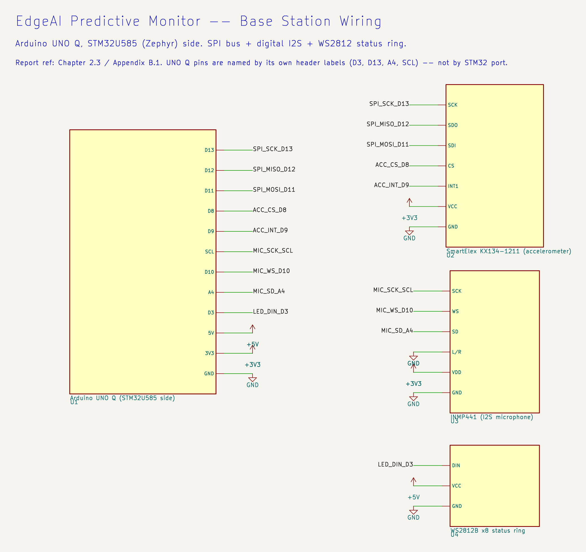

## B.2 Satellite node — Seeed XIAO ESP32-S3

| Signal | Pin | Notes |
|---|---|---|
| KX134 SPI SCK / MISO / MOSI | D8 / D9 / D10 | The board's fixed hardware SPI pins |
| KX134 chip select | D3 | Software GPIO |
| KX134 INT1 (buffer-full) | D2 | |
| INMP441 WS / LRCLK | D0 | |
| INMP441 BCLK | D1 | |
| INMP441 SD (data in) | D4 | |
| WS2812B ring data in | D5 | |

The XIAO ESP32-S3 breaks out only 11 GPIOs, so every assignment above is chosen
to keep the fixed hardware SPI lines free for the accelerometer — the one
peripheral that genuinely needs them. Node identity is derived from the board's
own Wi-Fi MAC address; there is no per-unit ID to set, no jumper to solder, and
no build flag to change between units.

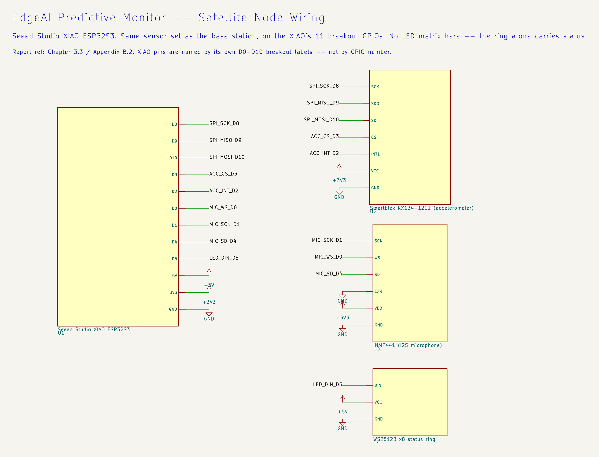

## B.3 Motor-driver rig — Arduino Uno + CNC Shield V3

| Signal | Pin | Notes |
|---|---|---|
| Shared driver enable (`~ENABLE`) | D8, active-LOW | **One line for all three driver sockets** — the shield has no per-motor hardware enable |
| Motor 1 (X) STEP / DIR | D2 / D5 | |
| Motor 2 (Y) STEP / DIR | D3 / D6 | |
| Motor 3 (Z) STEP / DIR | D4 / D7 | |

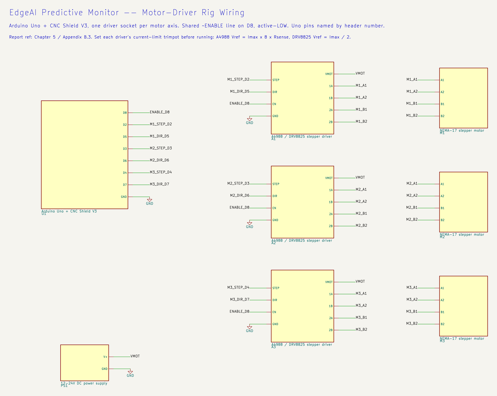

**The shared enable line is the reason the trip is implemented as a per-motor
step-pulse halt rather than a hardware disable.** Pulling `~ENABLE` high
de-energises all three drivers, which is wonderfully efficient right up until
you want to stop exactly one of them — it would stop two healthy machines to
protect one faulty one. Stopping step generation for one axis is the only
per-motor action this hardware supports, and it is exactly the constraint a
per-motor relay removes ([Chapter 13](#chapter-13-whats-next)).

**Set the driver current limit before running.** Each A4988/DRV8825 has a small
potentiometer setting its reference voltage; under-current skips steps and
over-current cooks the driver.

* A4988: `Vref ≈ Imax × 8 × Rsense`
* DRV8825: `Vref ≈ Imax / 2`

## B.4 Source files

The schematics above are real KiCad projects, not drawings — symbols and nets,
openable and editable — under `hardware/kicad/`, generated from Python so a
change to a net is a change to a script rather than a careful drag with a mouse.
The block diagrams throughout this report are generated the same way from
`report/diagrams/gen/`. Neither is hand-edited.

---

# Appendix C. Build one yourself

Five paths. **Two of them need no hardware at all**, which is the fastest way to
see the whole system working and the right place to start if you are evaluating
it before buying anything.

| Path | Hardware needed | Time | Good for |
|---|---|---|---|
| [C.1 Desktop dashboard + simulated node](#appendix-c-build-one-yourself) | **None** | ~10 min | Seeing the entire dashboard, setup, scoring and classifier flow on a laptop |
| [C.2 Simulated node against a real base station](#appendix-c-build-one-yourself) | UNO Q only | ~30 min | Testing the real device's ingestion and fleet handling without building satellites |
| [C.3 Base station](#appendix-c-build-one-yourself) | UNO Q + sensors | ~2 hours | The real thing, one machine |
| [C.4 Satellite node](#appendix-c-build-one-yourself) | XIAO ESP32-S3 + sensors | ~1 hour | Adding machines |
| [C.5 Motor-driver rig](#appendix-c-build-one-yourself) | Uno + CNC shield + steppers | ~2 hours | Reproducing the trip and this report's measurements |

Parts for C.3–C.5 are in [Appendix A](#appendix-a-bill-of-materials); pins are
in [Appendix B](#appendix-b-wiring-and-pinout-reference).

**If you are starting from nothing, do C.1 first.** It takes ten minutes, needs
no purchase, and everything you learn about the dashboard there is true of the
real device.

## C.1 No hardware at all — desktop dashboard + simulated node

This runs the **real** dashboard application on your own machine, fed by a
simulator that speaks the **real** wire protocol, replaying **real** captured
sensor data. It is not a mock: the registry, the feature pipeline, the
autoencoder, the setup flow, the thresholds, the classifier and the whole
frontend are the same code that runs on the board.

You need an MQTT broker on `localhost:1883` — the script checks for one and will
not start one for you:

```sh
sudo apt-get install -y mosquitto mosquitto-clients
sudo systemctl enable --now mosquitto
```

Then:

```sh
cd base-station
./start_desktop_dashboard.sh
```

That script creates a virtual environment, installs the dashboard and simulator
dependencies, starts the application on **port 8180** with an isolated data
directory (so it can never touch a real device's registry or history), starts one
simulated node, pre-configures it, and prints both URLs.

The simulated node starts **offline** on purpose — open its own control page and
press *Go Online* once you have looked at its configuration, or skip that with
`--auto-online`.

Useful flags:

| Flag | Effect |
|---|---|
| `--nodes N` | Run N independent simulated nodes, each with its own control page |
| `--captures-dir DIR` | Replay a different folder of `.npz` captures. Defaults to `base-station/captures/` |
| `--captures-dir ""` | Fall back to generated synthetic captures instead of real recordings |
| `--auto-online` | Bring the node online without a click |
| `--host 0.0.0.0` | Bind on every interface, so you can open the dashboard from a phone on the same network to check the mobile layout |

Each simulated node's own page lets you pick which capture file it streams,
toggle the accelerometer and microphone independently, switch between fused and
per-axis accelerometer output, choose which statistics ride along, adjust FFT
bin counts live, and watch its status LED change colour and mode as the base
station pushes status to it — exactly as a real node would.

**What you will not see:** the `base_station` asset itself. Its data comes from
the SPI-connected sampling chip, which does not exist on a laptop. Only
MQTT-driven nodes appear. That is expected, not a failure.

## C.2 A simulated node against a real base station

Once you have a UNO Q running (C.3), you can point the same simulator at the
real device over your LAN, which is how most of the fleet-level behaviour in
this report was exercised without building ten satellites.

One-time, on the device (this needs a password typed on-device, so no script can
do it for you):

```sh
adb shell
sudo apt-get update && sudo apt-get install -y mosquitto mosquitto-clients
echo -e 'listener 1883 0.0.0.0\nallow_anonymous true' | sudo tee /etc/mosquitto/conf.d/lan.conf
sudo systemctl enable --now mosquitto
```

The broker lives **on the UNO Q**, not on your laptop — matching how a real
satellite has to work, since it is a sensor with nowhere else to publish. Then,
from your machine:

```sh
cd base-station
./start_sim_node.sh --captures-dir captures --nodes 2
```

The simulator connects out over plain LAN, exactly as a real node would. USB is
used only for the occasional setup step, never for live traffic — so a momentary
USB blip cannot flip a node "offline" on the dashboard.

## C.3 The base station

**One-time device provisioning.** These configure things outside the application
container and only need running once per board:

```sh
cd base-station
./provision-spi.sh      # the MCU<->MPU SPI bulk link
./provision-baud.sh     # sets the serial link to 500000 baud on the Linux side
./provision-wifi.sh     # Wi-Fi onboarding: hotspot fallback + captive portal
```

`provision-baud.sh` matters more than it looks: the Linux-side router's baud
must match the firmware's, and a mismatch breaks the whole link silently, with
no error anywhere. See [§10.4](#chapter-10-under-the-hood).

**Flash the real-time side.** Open `base-station/sketch/` in Arduino App Lab and
flash it to the STM32U585.

**Build, deploy and run the Linux side:**

```sh
cd base-station
./start_dashboard.sh
```

This forces normal (non-raw-capture) mode, builds, flashes, pushes the
application, waits for its container, and prints **the board's own LAN IP URL**.
Use that link, not a localhost one — a real deployment has no port forwarding
available.

**Then set up your first machine.** Open the dashboard, find the asset that has
appeared on its own, and press **Set up**. The drawer walks you through all six
steps of [§5.2](#chapter-5-teaching-it-what-normal-feels-like): name it and give
it a class, switch the machine **off** and measure, switch it **on** and collect
one or more running conditions, train, and — if you have the motor rig from C.5
— confirm which output stops it. Four to six minutes, and the machine is live.

The one instruction that carries real weight is step 2. The software cannot
verify the machine is off, so it says so on the screen, and it means it: a
baseline captured while the machine is running teaches the system that its own
vibration is silence, and the running/stopped gate will never work again until
you re-measure it.

**Telegram alerts** need one secret: set `TELEGRAM_BOT_TOKEN` as the
`arduino:telegram_bot` brick's variable through App Lab's interface, and re-add
that brick to `app.yaml`. The bot's username is resolved automatically at
startup, so there is no second value to configure. With the token unset, every
alert path no-ops cleanly.

## C.4 A satellite node

```sh
cd satellite
pio run                # build
pio run -t upload      # flash over USB
pio device monitor     # optional serial console, 115200 baud
```

Then follow [§4.2](#chapter-4-growing-the-fleet): power it up, join the
`EPM-SAT-<id>` network from a phone, fill in three fields. **There is no
credential to compile in.** For a bench board being reflashed constantly, a
dev-only shortcut exists — pass `WIFI_SSID` and `WIFI_PASSWORD` as build flags
in `platformio.ini` and the node seeds its storage on first boot and skips the
portal. A real build passes neither and the shortcut is a no-op.

## C.5 The motor-driver rig

1. Set each driver's current limit before applying power — see
   [Appendix B](#appendix-b-wiring-and-pinout-reference).
2. Flash `motor-driver/src/main.cpp` to the Arduino Uno with PlatformIO.
3. Start the rig host, which serves the control page and receives trips:

   ```sh
   cd motor-driver
   ./start_motor_driver.sh                                # broker on localhost
   ./start_motor_driver.sh --mqtt-host <base-station-ip>  # or over the LAN
   ```

   The Uno's port is autodetected; pass `--port` if two boards are attached.

   Open **http://localhost:8000/** in Chrome or Edge, click **Connect**, and
   pick the Uno's port. The rig starts with **one** motor installed; the empty
   slots add the others, and each one added is announced to the base station as
   a trip output straight away. Add `--profile` to run a scripted capture
   profile instead of driving by hand.
4. On the base station's dashboard, work through setup for the asset you want
   protected. At step 5 the outputs the rig announced appear as real candidates;
   press **Test** and watch the machine stop. One motor may only be claimed by
   one asset; the list shows already-claimed motors as unavailable rather than
   failing after the fact. Back on the control page, that motor now carries a
   **PROTECTED** badge naming the asset — and if the trip ever fires, its card
   turns red and locks until a human presses **Reset & re-arm**.

## C.6 Changing the wire format

`base-station/telemetry_schema.json` is the single source of truth for the frame
format ([Appendix F](#appendix-f-wire-protocol-specification)). Any edit must be
followed by regenerating every generated side, so the base station, the
ingestion parser and the satellite firmware cannot drift apart:

```sh
python3 base-station/python/tools/gen_telemetry_schema.py
```

## C.7 Running the tests

Each test module is a standalone script rather than a pytest suite, and declares
the `PYTHONPATH` it needs in its own docstring. For example:

```sh
PYTHONPATH=base-station/python/ingestion:base-station/python/pipeline \
  python3 base-station/tests/gate_test.py
```

See [Appendix J](#appendix-j-test-suite-and-verification-record) for what is
covered.

---

# Appendix D. Sensor selection rationale

The KX134-1211 is the vibration transducer at every sensing point in this
architecture — base station and every satellite node alike. It was chosen over
both hobby-grade and industrial-grade alternatives on six criteria.

| Criterion | Hobby grade | **KX134 (selected)** | Industrial grade |
|---|---|---|---|
| Max output rate / usable bandwidth | ~1 kHz / 250–500 Hz | **25.6 kHz / 12.8 kHz** | continuous / ~11 kHz (needs an external ADC) |
| Dynamic range | fixed | **software-selectable ±8/16/32/64 g** | fixed, part-specific |
| Noise density | ~300 µg/√Hz | **~130 µg/√Hz** | 25–80 µg/√Hz |
| Interface | often analogue | **digital SPI, 16-bit ADC on-chip** | often analogue |
| Buffering | none | **512-byte hardware FIFO** | varies |
| Unit cost (India) | ₹150–350 | **≈ ₹900** | ₹3,800–7,200 |

Each line mattered for a specific reason:

* **Bandwidth was a hard filter, not a preference.** Early-stage fault
  signatures — micro-pitting, incipient bearing race damage — live in the
  2–10 kHz band. A sensor that physically cannot see that band cannot be
  compensated for downstream, no matter how good the processing is. Hobby
  sensors are eliminated by this line alone.
* **Dynamic range in software, not in the part number.** Selectable
  ±8/16/32/64 g means the same physical part works on a quiet bench rig and on a
  production motor with real startup transients — no hardware swap, no second
  part to stock.
* **Noise density sets the detection floor.** A noisy sensor raises the
  effective anomaly threshold before any software runs, hiding exactly the small
  early signals this system exists to catch. This is also the property that
  turned out to matter most in
  [Appendix H](#appendix-h-motor-state-gate-calibration) — in a way that was not
  fully appreciated until that debugging session.
* **The FIFO changes the real-time budget.** Without it the host must service
  the sensor roughly every 39 µs at full rate — an aggressive interrupt load for
  a chip that also runs FFTs and manages a link. With it, the sensor batches
  samples and raises one interrupt per block, turning a high-frequency servicing
  problem into a manageable batched one on both the STM32U585 and the ESP32-S3.
* **Cost matters at fleet scale, not per unit.** This architecture targets 20+
  sensing points. At ≈₹900 the sensor count stays close to linear; at industrial
  pricing the same fleet target becomes prohibitive.
* **Regional availability was a scheduling constraint.** The KX134 here sits on
  the SmartElex breakout, sourced through the Indian electronics market —
  avoiding the shipping and import lead time of industrial parts against a fixed
  deadline.

No single criterion justifies the KX134 alone. Hobby sensors fail on bandwidth;
industrial sensors fail on cost and lead time. It is the first point in the
market where every constraint is satisfied at once.

---

# Appendix E. Network and transport selection rationale

Satellite nodes needed a link that was both **real-time** (continuous spectrum
streaming, not periodic bursts) and **bidirectional** (the base station must be
able to send commands back). Three options were evaluated.

**BLE advertise-only (beacon pattern).** Attractive for scaling to 20+ nodes
with minimal per-connection overhead and low power. Rejected once bidirectional
control became non-negotiable: advertising is inherently one-way, and no
protocol cleverness fixes a fundamentally one-directional transport.

**BLE GATT (connection-based).** Natively bidirectional — notify from node,
write from base station — and would have kept the project inside the radio stack
originally planned. Rejected after investigation surfaced multiple documented
reliability issues in the Linux BlueZ stack with concurrent GATT connections to
more than one peripheral from a single central, including service resolution
hanging on the second concurrently-connected device, reproduced across several
BlueZ versions. For a link with no acceptable downtime, discovered late against
a fixed deadline, that was disqualifying on its own.

**Wi-Fi with an MQTT broker on the UNO Q — selected.** The board's wireless
module supports access-point mode, so the base station can host its own network
rather than depending on venue Wi-Fi, which cannot be trusted at a competition.
ESP32 nodes join as clients; an MQTT broker on the UNO Q mediates traffic in
both directions. This won on:

* **Reliability** — mature, well-understood Wi-Fi/TCP/MQTT, none of BLE's
  concurrency problems for this use case.
* **Throughput** — full-resolution spectra stream comfortably, with none of
  BLE's aggressive payload-size constraints. A satellite's ~4.1 KB frame every
  200 ms is ~164 kbps, which is nothing on Wi-Fi and impossible on BLE.
* **Infrastructure reuse** — the same broker and the same ingestion backend
  already used everywhere else in the system.

The accepted trade-off, stated plainly: Wi-Fi's continuous radio use is not
inherently lower-power than BLE. But sustained real-time streaming had already
negated BLE's main power advantage, so this was assessed as a wash rather than a
net loss.

BLE advertise-only remains a credible *production-scale* direction for a much
larger deployment — 20+ nodes sending periodic health summaries rather than live
spectra. It is noted here as a genuine future option, deliberately not the one
this build prioritised.

---

# Appendix F. Wire protocol specification

Two sensing paths — the base station's internal chip-to-chip link and every
satellite's Wi-Fi link — carry the same conceptual message types over different
framing, chosen to match what each transport already guarantees. A UART is a raw
byte stream with no message boundaries; MQTT already provides framing,
addressing and delivery semantics.

## F.1 Message types, shared by both transports

| Type | Name | Direction | Purpose |
|---|---|---|---|
| 0x01 | `SPECTRUM` | Node → Base | FFT bins + statistics from vibration/audio sensing |
| 0x02 | `HEALTH_ALERT` | Node → Base | Anomaly threshold crossing |
| 0x03 | `HEARTBEAT` | Node → Base | Liveness, current configuration echo |
| 0x04 | `COMMISSION_START` | Base → Node | Begin setup capture |
| 0x05 | `COMMISSION_DONE` | Base → Node | Setup complete; switch to inference |
| 0x06 | `CONFIG_SET` | Base → Node | Sample rate, FFT size, active channels |
| 0x07 | `ACK` | Either | Acknowledge a critical message |
| 0x08 | `STATUS_LED` | Base → Node | Drive the node's ring to match its dashboard status |

`SPECTRUM` and `STATUS_LED` are the two in production use today. The rest share
this numbering so ingestion treats a message uniformly no matter which link it
arrived on, as they are built out.

The trip itself is a separate MQTT message to the motor rig, not one of these —
the rig is an actuator, not a sensing node, and it shares none of this
vocabulary beyond the topic convention.

## F.2 The frame itself is a section list, not a fixed struct

The payload is deliberately generic: a list of sections, each declaring what it
is, what channel it belongs to, and how long it is. A node sends a spectrum
section per active channel, a statistics section, and — periodically — decimated
time-domain sections for the raw-signal charts.

That shape is what makes the rest of the architecture hold together. A node with
no microphone simply sends fewer sections. A node with a different bin count
sends different lengths, and the ingestion side commits that asset's model
dimension from its own first frame rather than assuming a fleet-wide constant.
Adding a channel does not break an existing node.

The layout is defined **once**, in `base-station/telemetry_schema.json`, and the
encoder/decoder for every side is generated from it — see
[Appendix C](#appendix-c-build-one-yourself). Three codebases in two languages
cannot drift apart, because none of them contains a hand-written copy of the
format.

## F.3 UART framing (internal to the base station)

```
[SYNC: 2B][VER: 1B][TYPE: 1B][NODE_ID: 1B][LEN: 2B][PAYLOAD: N][CRC16: 2B]
```

`SYNC` is a fixed `0xAA55` so a receiver can resynchronise after a dropped byte.
`NODE_ID` is always `0x00` — this link is point-to-point, and the field exists
only for symmetry with the Wi-Fi side. `CRC16` covers `VER..PAYLOAD`. The link is
full duplex: the sampling chip can stream on TX while receiving a control
message on RX.

## F.4 MQTT framing (satellite nodes)

Topics, per node, with `<node_id>` derived from the node's own Wi-Fi MAC:

```
epm/<node_id>/data    Node -> Base   (SPECTRUM, HEALTH_ALERT, HEARTBEAT)
epm/<node_id>/cmd     Base -> Node   (STATUS_LED, COMMISSION_START, CONFIG_SET, ...)
epm/<node_id>/ack     Either         (ACK)
```

Since MQTT already frames and addresses each message, the envelope is leaner —
just a type byte in front of the same type-specific payload:

```
[TYPE: 1B][PAYLOAD: N]
```

`STATUS_LED`'s payload — `[RGB: 4B][MODE: 1B][PERIOD_MS: 2B]` — is byte-identical
on both transports, so a satellite's ring and the base station's own ring always
mean the same thing by "breathing amber". One colour table, one mode enum, shared
everywhere a status light exists.

**The motor rig subscribes to `epm/+/cmd`, not to one node's topic.** It routes
on the output index inside the payload, because that index is what identifies an
output; the node ID in the topic is incidental. The single-topic version worked
perfectly for exactly one asset and published a second asset's trip into the
void — found while writing the setup plan, before it could be found by a machine
that failed to stop.

## F.5 Quality of service

| Message type | QoS | Why |
|---|---|---|
| `SPECTRUM`, `HEARTBEAT` | 0 | High frequency; the next one is along shortly |
| `HEALTH_ALERT`, `COMMISSION_*`, `CONFIG_SET`, `STATUS_LED` | 1 | Must arrive; duplicates are harmless because all are idempotent |
| Trip / motor stop | 1 | Must arrive. Also idempotent — a duplicated stop is still a stop |
| Rig output announcement | 1, **retained** | A dashboard that starts later must still learn what outputs exist |
| `ACK` | 0 | Advisory only |

---

# Appendix G. Sensor configuration envelope

What this hardware can actually be pushed to, what we run at, and how to change
it. Referenced from [§5.9](#chapter-5-teaching-it-what-normal-feels-like).

## G.1 Accelerometer

| | Hardware ceiling | **What we run** | Why |
|---|---|---|---|
| Output data rate | 25,600 Hz | **12,800 Hz** | See below |
| Usable bandwidth (Nyquist) | 12.8 kHz | **6.4 kHz** | |
| Range | ±8 / 16 / 32 / 64 g, selectable in firmware | ±16 g | Bench rig; raise for machines with real startup transients |
| Resolution | 16-bit | 16-bit | |
| FIFO | 512 bytes | Used, interrupt per block | Removes a ~39 µs servicing deadline |

**Why not the full 25.6 kHz.** It was tried, on real hardware, as a controlled
A/B test. At the full rate the sampling thread stopped yielding often enough and
starved the inter-processor link outright — telemetry frames went to zero. The
sampling thread runs above the link's own thread by design, so it wins that
contest completely. 12,800 Hz is eight times the original 1,600 Hz baseline and
leaves real headroom.

If you need the top of the band — and a machine with genuine 6–12 kHz fault
content might — the fix is the thread priority relationship, not the rate: the
sampling thread has to yield inside its block loop. That is a known, scoped
piece of work, not an unknown.

## G.2 Microphone

| | Value |
|---|---|
| Interface | I²S / SAI, 24-bit |
| SNR | 61 dBA |
| Frequency response | ~60 Hz – 15 kHz |
| FFT window | 2048 samples |

## G.3 Spectral resolution — three independent knobs

This is the part most worth understanding, because the trade-off is not the one
people expect. There are **three separate bin counts**, and they are deliberately
not the same number:

| Knob | Base station | Satellite | What it controls |
|---|---|---|---|
| **Native FFT bins** | 512 per channel | 512 per channel | The real analysis resolution, and the length of the time-domain window the six statistics are computed over |
| **Model / wire bins** | 128 per channel | 128 per channel | How many buckets the spectrum is average-pooled to before transmission — what the model actually sees |
| **Legacy RPC view** | 32 per channel | — | A small polled view for diagnostics, constrained by a 256-byte round trip |

Keeping the native FFT dense at 512 while pooling to 128 on the wire is a
deliberate split. The pooling shrinks the payload; it does **not** shorten the
analysis window, so the statistics keep their full-length time-domain input.
Halving the wire bins would halve bandwidth without touching the quality of the
statistics.

**128 wire bins is not a guess.** It came out of an offline sweep over real
captures — axis handling, bin count, microphone inclusion and which statistics —
scored on worst-case fault separation. The winning configuration was per-axis
accelerometer, 128 bins, 128 microphone bins, all six statistics, giving a
536-dimension input vector at **+38.5σ** worst-case separation.

## G.4 Throughput

| | Base station | Satellite |
|---|---|---|
| Frame production period | 64 ms (~15.6 frames/s) | 200 ms (5 frames/s) |
| Transport | Dedicated SPI, ~40 MHz | Wi-Fi / MQTT |
| Approximate frame size | ~10–14.5 KB (with time-domain sections) | ~4.1 KB |
| Approximate sustained rate | well inside the SPI budget | ~20.5 KB/s (~164 kbps) |

Time-domain sections do not ride every frame. They piggyback on **every fourth**
frame, because the collapsed raw-signal charts do not need per-frame freshness
and carrying them every time would drag the whole frame's transfer — and
therefore the anomaly score and the spectra — down with them. The fast path stays
fast.

## G.5 Where to change all of this

Every knob above is a named constant in one header per board —
`base-station/sketch/app_config.h` and `satellite/include/app_config.h` — each
carrying the measurement or the failure that produced its current value. Nothing
in this list is a magic number without a paper trail.

A node's wire bin count does **not** have to match the base station's. The
ingestion side commits each asset's model dimension from that asset's own first
frame, so a satellite is free to run a different configuration from the board it
reports to.

---
# Appendix H. Motor-state gate calibration

[Chapter 8](#chapter-8-the-day-it-stopped-itself) told the short version. This is
the full one, because the process — three wrong layers before the real cause —
is worth more to a future reader than the fix alone.

## H.1 The question

Before the system can decide "this machine just stopped" — needed to suppress
false scores at rest, to confirm a trip actually landed, and to confirm which
motor a machine is wired to ([§5.3](#chapter-5-teaching-it-what-normal-feels-like))
— it needs a reliable way to tell running from stopped from vibration energy
alone.

The first version used an absolute threshold on a single energy number. It failed
early and obviously: the default threshold was 0.05 while real running energy
measures around 19,000 — a 250,000× margin, meaning the stopped state was
literally unreachable on real hardware. It went unnoticed for a while because the
unit tests used single-digit synthetic values, a scale hardware never produces.

The fix was to make the threshold *relative* to each node's own running-energy
reference rather than a global constant. Correct in principle — and it only
pushed the real problem one layer down.

## H.2 Layer two: blaming the microphone

The relative gate initially summed *every* channel, microphone included, into one
energy number. Ambient shop noise has nothing to do with whether a motor is
turning, so excluding it looked like the obvious fix.

It was implemented, and it was right in principle. Measured live, it barely moved
the number: ~6,600–7,250 combined versus ~7,000–8,000 accelerometer-only. Same
order of magnitude. Whatever was keeping idle energy close to running energy was
coming from the accelerometer channels themselves.

## H.3 Layer three: a reasonable hypothesis that was wrong

Next hypothesis: a DC/gravity bias. If FFT bin 0 carries a large constant offset
from gravity, it would dominate an RMS regardless of whether the motor was
spinning — which would neatly explain idle and running looking like the same
order of magnitude.

It was a reasonable theory, and it was checked before anything was built on it.
It was wrong twice over, which is impressive for one theory: the firmware's own
magnitude routine already discards bin 0 before this code ever sees it, and real
captured windows confirmed it from the other direction — the raw gravity offset
sits at a mean of about 4,228 counts, and none of it appears anywhere in the bins
software receives.

Worth recording as a *negative* result. The hour spent disproving it was cheaper
than the week that would have gone into building on it.

## H.4 The real cause: the sensor's own noise floor

The gate computed an RMS over *every* bin of every accelerometer channel — 384 of
them for a three-axis, 128-bin node. Measured live, per pooled bin, stopped
versus running at 90 RPM:

| Bin | ~Hz | Stopped | Running | Delta |
|---:|---:|---:|---:|---:|
| 2 | 131 | 13,192 | 36,134 | **+22,942** |
| 5 | 281 | 12,680 | 44,798 | **+32,118** |
| 7 | 381 | 13,586 | 40,638 | **+27,052** |
| 12 | 631 | 13,453 | 13,545 | +92 |
| 24 | 1,231 | 11,217 | 11,482 | +265 |
| 64 | 3,231 | 5,525 | 5,483 | −42 |

The motor's entire mechanical signature is a handful of narrow lines below
~600 Hz — the stepper's own step rate, 90 RPM × 200 full steps = 300 Hz, landing
squarely on bins 5–7. Every other bin, which is the overwhelming majority of the
spectrum, is the accelerometer's own broadband electrical noise, present
identically whether the machine runs or not.

Averaging across all of it was mostly a measurement of the accelerometer.

This also explains something otherwise puzzling in the classifier work: fault
classes captured from this rig look nearly identical to each other above roughly
bin 24, because above the motor's own signature every class is looking at the
same noise. See [Appendix I](#appendix-i-classifier-research-history).

## H.5 The fix

Rather than trusting a formula to separate signal from noise, each node now
measures its own noise floor directly: it captures **≥30 frames with its machine
deliberately off**, fits a per-bin median floor, and the gate thereafter counts
only the *excess* over that floor. That measurement is step 2 of the guided setup
([§5.2](#chapter-5-teaching-it-what-normal-feels-like)).

| Method | Stopped | Running | Worst-case margin |
|---|---:|---:|---:|
| Full-spectrum average | 7,480 | 11,137 | 1.18× |
| Excess over measured baseline | 1,414 | 6,194 | **2.09×** |

Two properties of the fix matter as much as the number:

* It is **independent of the existing running-energy reference.** A node with no
  captured baseline keeps its previous behaviour exactly, so capturing one can
  never invalidate an existing model or force a retrain.
* Energy and threshold are always derived **together, on the same basis**, from
  the same measurement — so the two numbers are never compared across scales.

## H.6 Alternatives that measured worse

Both were implemented and measured rather than reasoned about:

* **Band-limiting to the motor's own frequency range** (bins 0–7 only) instead
  of subtracting a floor: separated **worse** — 1.09× against 2.09×. The noise
  floor turns out to be *tallest* in exactly the low bins where the real signal
  also lives, so narrowing the window does not escape it. This is the least
  intuitive result in the whole project.
* **Reference-free peakiness / spectral-flatness metrics:** every one of them
  overlapped between stopped and running in the worst case observed.

## H.7 Live verification

All of the above ran against real hardware, not simulation: baseline captured
with the rig confirmed physically off (65 frames, reference 1,533.1, spread
1.39×, threshold 2,682.9); the node observed going from flapping fault/warning at
rest to settling cleanly on idle; the rig spun back up and observed leaving idle
immediately; training against the running rig produced a healthy score of 0.046
against a warning threshold of 0.144; ramping down returned cleanly to idle
rather than fault; and the dashboard was checked against the live device in a
real browser with zero console errors throughout.

## H.8 A known, accepted limitation

The test rig's three motors share one physical vibration sensor. With motor 1
tripped and motors 2 and 3 still spinning, that shared sensor still reads
*running*, because it genuinely is still feeling the other two. The sensor is not
lying; it is honestly feeling two other motors. This is a property of one sensor
covering three motors on a bench rig, not a software defect — a real deployment
has one sensor per machine.

---

# Appendix I. Classifier research history

The fault classifier ([Chapter 6](#chapter-6-naming-the-fault),
[Chapter 7](#chapter-7-training-the-classifier-with-edge-impulse)) names *which*
fault is present. Getting there was a real research process, and two
data-integrity bugs were caught along the way that would otherwise have quietly
inflated a reported number.

**A note on the numbers below.** The accuracy figures in §I.2–§I.4 come from the
early phase, when the classifier was trained on a **public Kaggle dataset
replayed through a simulated node** — before any physical fault data from this
project existed. They are recorded here as method history, not as a statement
about the current model, which is trained on this rig's own captures
(§I.5). Do not quote them as this system's performance.

## I.1 Starting point: a public dataset, replayed

The first version trained against a public Kaggle vibration dataset — four
classes: healthy, cracking, offset pulley, wear — replayed through a simulated
satellite node, so the whole classifier path could be built and tested end to end
before any physical fault data existed. This established the workflow: upload
labelled spectra, design a feature pipeline, train, read a confusion matrix,
export a deployable model.

## I.2 Bug one: train/test leakage

An early run reported a low but plausible-looking accuracy. Before trusting it,
the split was checked — and it was leaking: windows from the same source file
were landing in both the training and test sets, so the model was partly being
tested on data adjacent to what it trained on.

The fix was a **file-level split**: an entire source file goes to either train or
test, never both. Any accuracy figure from before this fix is explicitly
considered stale and is not quoted anywhere in this report.

## I.3 Bug two: data corruption in the upload path

A second, deeper bug was found in the signal-loading step used to prepare every
upload — affecting every dataset uploaded to that point, not one run. This is the
kind of bug that does not announce itself: the pipeline ran, the numbers looked
plausible, and the data was wrong.

After fixing it, a raw triaxial re-run scored **59.82%** on Edge Impulse's own
trained model. A from-scratch local replication of a reference paper's classical
KNN method, on the same corrected data, scored **69.64%**.

A classical method beating the cloud-trained network on that specific dataset and
feature representation is a genuine result, and it is kept here rather than
quietly dropped. It is also what prompted the move to per-axis features and the
six statistics, which is where the real gains came from
([§12.5](#chapter-12-proof-not-promises)).

## I.4 A deliberate strategic pivot

At that point accuracy was still improving with tuning, but the marginal return
on more hyperparameter chasing was judged lower than the return on finishing the
rest of the system — the gate, the trip, the dashboard, satellite bring-up.

Stating that plainly matters, because the alternative is implying the number
above was a ceiling. It was not. It is the point at which effort was consciously
redirected.

## I.5 Moving to real hardware data

The classifier then moved off replayed public data onto **541 captures taken
directly from this project's own rig**, across bearing, healthy, loose-mount and
unbalanced conditions — converted to 536-dimension per-axis spectra plus
statistics and uploaded to a dedicated Edge Impulse project.

Because each fault condition exists as a single continuous capture rather than
many independent short samples, the file-level split from §I.2 is not available
here. A **contiguous-tail split** was used instead — the last portion of each
file reserved for test and never seen in training — the closest leakage-free
approximation available under that constraint. This is a real methodological
limitation and it is stated rather than papered over.

`[FILL IN: current model's accuracy / confusion matrix from Edge Impulse Studio]`

> **[SCREENSHOT: the Edge Impulse project — data collection view and the confusion matrix]**

## I.6 One model per asset class

The dashboard's classifier workflow was reworked around one card per **asset
class** rather than per node, with a pooled per-class normalisation baseline
fitted from every recording of that class. That is what turns "train once, cover
every identical lathe" from an aspiration into a built capability
([§6.2](#chapter-6-naming-the-fault)).

## I.7 A bug only the real service could find

Testing against a real Edge Impulse account — rather than local tooling alone —
surfaced broken axis naming in the uploaded feature columns. It was fixed by
naming every column explicitly and correctly (`accel_x_bin0`, `rms_x`, and so on)
and wrapping them in a proper features input block. The full detour, including
the two input-block shapes that were tried and rejected first, is in
[§7.4](#chapter-7-training-the-classifier-with-edge-impulse).

A good reminder that a pipeline which passes every local test can still behave
differently the moment it meets the real external system it was built against.

---

# Appendix J. Test suite and verification record

## J.1 Automated tests

The backend carries **34 test modules**, exercised on every change. Each is a
standalone script declaring the import path it needs, rather than a framework
suite — see [Appendix C](#appendix-c-build-one-yourself) for how to run them.
About 8,900 lines of test code against roughly 13,000 lines of backend.

Coverage, by area:

| Area | Modules |
|---|---|
| Registry, statuses and legal transitions | `registry_test` |
| Feature building and normalisation | `features_test`, `raw_features_test` |
| Model, setup flow and training | `autoencoder_test`, `commissioning_test`, `setup_test`, `inference_test` |
| Running/stopped gate and stopped baseline | `gate_test`, `stopped_baseline_test` |
| Machinery protection and the trip chain | `protection_test` |
| Wire protocol, frame codec, schema | `wire_protocol_test`, `telemetry_frame_test`, `spi_link_test` |
| Ingestion and routing | `pipeline_manager_test`, `mqtt_subscriber_test` |
| Classifier and the Edge Impulse path | `classifier_test`, `ei_client_test`, `ei_controller_test`, `ei_projects_test`, `ei_scaling_test` |
| Capture and history | `capture_test`, `history_test` |
| Displays | `display_rgb_test`, `display_matrix_test`, `matrix_status_test`, `matrix_status_device_test`, `status_color_test` |
| Sampling | `accel_sampler_test`, `mic_sampler_test` |
| API, alerts, performance, simulator | `api_test`, `alert_store_test`, `telegram_alerts_test`, `perf_test`, `satellite_node_sim_test` |

Some of these are built from **real captured sensor data rather than synthetic
numbers**, and that is deliberate: a hand-written "quiet" spectrum was too clean
to have caught the noise-floor problem in
[Appendix H](#appendix-h-motor-state-gate-calibration) — the first gate's unit
tests used single-digit values against a threshold of 0.05, on hardware that
produces five-figure energies. Synthetic test data that is tidier than reality
will confirm whatever you already believe.

`setup_test` in particular asserts something that only matters because it was
once wrong: that training hands on to the trip-output step rather than jumping
straight to Done. Reordering the steps once silently skipped the relocated one,
because the training code had the final step's name hardcoded.

A small, documented subset needs on-device-only libraries and is therefore
excluded from off-hardware runs. Those are expected gaps, not failures.

## J.2 How each live claim was checked

| Claim | How it was verified |
|---|---|
| 1.18× → 2.09× gate margin | Live capture on the rig, stopped and running, per-bin energy compared directly |
| 65-frame baseline, threshold 2,682.9 | One real setup session, values read from the device |
| Healthy 0.046 vs warning 0.144 | Same session, trained against the running rig |
| Multi-condition cost: 0.146/0.292 → 0.745/1.490 | Same rig, same frame counts, one condition then two; a 2.4× overspeed observed tripping under one and not under two |
| Trip stops the motor and latches | Repeated live runs; console output and physical motor observed |
| Trip clears and the machine resumes | Same runs, in the reverse direction |
| Failed trip is not reported as tripped | Induced deliberately by pointing the trip output at an uncoupled motor and faulting the coupled one; status confirmed to stay Fault |
| Setup test lands on Idle, a real fault lands on Tripped | Both observed against the same output minutes apart in one session |
| Confirm-by-stopping: right output, wrong output, already-stopped machine | All three exercised live; the third correctly refused with a conflict rather than publishing |
| Rig output announcement populating the dashboard | Live, over MQTT, retained |
| Per-axis +38.5σ vs fused +1.8σ | Offline sweep over real captures through the production feature pipeline |
| Dashboard behaviour under live data | Real browser against the live device; console checked for errors |
| Trip banner, all four states, on all five tabs | Live, with the failure state staged deliberately |
| Wi-Fi onboarding captive portal | Real phones, three rounds of live testing |
| GPU speed-up ≈ 1.0× | Live benchmark on the board, single vector through 256-node batch, output verified bit-exact against CPU |

## J.3 What is *not* verified on hardware

Stated here so the list above can be trusted.

* **Satellite nodes have not been run on a physical XIAO ESP32-S3.** The
  firmware builds, and its frames decode correctly against the base station's
  parser, and the whole fleet path has been exercised through the node simulator
  against the real device. The hardware bring-up itself is outstanding.
* **The current classifier's accuracy figure** is not yet transcribed from Edge
  Impulse Studio into this report (§I.5).
* **Telegram alerts** were demonstrated live earlier, but are switched off in
  the current build pending one configuration value
  ([§9.11](#chapter-9-what-the-operator-actually-sees)).

---

# Appendix K. 3D-printed test rigs

> **[PLACEHOLDER — to be written]**
>
> This appendix will cover the 3D-printed fixtures used to hold sensors and to
> induce repeatable, known faults on the bench: what each part is, why it is
> shaped the way it is, print settings, and the source models.
>
> To fill in:
>
> * **[MODEL: sensor mounting bracket]** — the rigid coupling between the
>   accelerometer and the machine housing, and why rigidity here changes what
>   the sensor can see (see [Appendix A](#appendix-a-bill-of-materials)).
> * **[MODEL: motor mount / test bed]** — the frame holding the three NEMA-17
>   motors.
> * **[MODEL: fault-induction fixtures]** — the parts used to produce
>   repeatable imbalance and loose-mount conditions for the labelled captures in
>   [Appendix I](#appendix-i-classifier-research-history).
> * **[PHOTO: printed parts, assembled and in use on the rig]**
> * Print settings: material, layer height, infill, orientation.
> * Source files and licence.

---

# Appendix L. Reading the source

For anyone who opens the repository and wants to know where to start.

The repository's own `README.md` is the short version of this appendix — what
the system is, the ten-minute no-hardware path, and a map of the tree. The whole
project is released under the **MIT licence**, so anything here can be reused,
modified or sold on, with attribution and without asking.

## L.1 Layout

```
README.md                  the short version of this appendix
LICENSE                    MIT
base-station/
  app.yaml                 App Lab manifest: name, ports, bricks
  telemetry_schema.json    single source of truth for the wire format
  sketch/                  Zephyr firmware, STM32U585 side
    sketch.ino             entry point and thread startup
    accel_sampler.*        KX134 over SPI, FIFO-driven
    mic_sampler.*          INMP441 over SAI
    fuser.*                FFT, statistics, pooling, frame assembly
    spi_link.*             the bulk telemetry link to Linux
    rgb_display.*          WS2812 ring, DMA-timed
    matrix_display.*       the board's own 8x13 matrix
    app_config.h           every tunable constant, each with its rationale
  python/                  the Linux-side application
    main.py                wiring: constructs everything and starts the threads
    api/                   FastAPI routes, the WebSocket, one controller per flow
    ingestion/             SPI reader, MQTT subscriber, frame types
    pipeline/              features, gate, autoencoder, inference, classifier,
                           capture, and the Edge Impulse client
    registry/              the asset registry, its state machine, status colours
    protection/            the trip, and the rig's announced outputs
    alerts/                Telegram bot and subscriber store
    history/               durable score history
    monitoring/            performance metrics
    network/               Wi-Fi bridge client
    common/                wire protocol + generated telemetry codec
    frontend/              index.html, style.css, and five JS modules
    tools/                 code generation and one-off utilities
  host/                    privileged host-side bridges (SPI, Wi-Fi, GPU)
  tests/                   34 standalone test modules
satellite/                 PlatformIO project — XIAO ESP32-S3 node firmware
motor-driver/              PlatformIO project (Uno) + the rig host + control page
hardware/kicad/            three real KiCad schematics, generated from Python
report/                    this document, and the generators for every diagram in it
```

## L.2 Where to start reading

| If you want to understand… | Start at |
|---|---|
| How everything is wired together | `base-station/python/main.py` — it constructs every object in dependency order and the reading order is the architecture |
| How a frame becomes a status | `pipeline/manager.py`, then `pipeline/features.py`, then `pipeline/inference.py` |
| The decision to stop a motor | `protection/protection.py` — its module docstring states the safety invariants the rest of the file keeps |
| The guided setup | `api/setup_controller.py` — step order, and why the trip-output step sits where it does |
| Why the gate works the way it does | `pipeline/gate.py` and `pipeline/stopped_baseline.py` |
| The Edge Impulse path | `pipeline/ei_client.py` (REST) and `api/ei_controller.py` (orchestration) |
| The dashboard | `frontend/app.js` for the Fleet page and the trip banner; one module per other tab |

## L.3 Conventions the code holds to

These are worth knowing because they are consistent, and because breaking one is
usually how a bug got in.

* **Module docstrings carry the *why*, not the *what*.** Almost every non-trivial
  module opens with the decision that produced its current shape, including the
  approaches that were tried and rejected. `pipeline/classifier.py` explains why
  it is CPU-only in enough detail that nobody has to re-run the GPU spike.
  `api/setup_controller.py` explains why its steps are in that order, and
  explicitly asks the reader not to move one of them back.
* **A constant with a story keeps its story next to it.** `app_config.h` on both
  firmware sides carries the measurement or the failure that produced each
  value, so 12,800 Hz and 500,000 baud are not mystery numbers.
* **Dependency injection over mocking libraries.** Anything that talks to the
  outside world — the Edge Impulse client, the TFLite interpreter, the gate — is
  passed in, so tests substitute a plain object with the same function names and
  never touch the network or need a runtime installed.
* **Generated code is never hand-edited.** The telemetry codec on all three
  sides comes from one schema file; the KiCad schematics come from Python; the
  diagrams in this report come from Python. Regenerate, don't remember.
* **Deliberately dependency-light in the production path.** The Linux
  application's third-party requirements are essentially PyTorch, `psutil`, a
  state-machine library and the TFLite runtime. The Edge Impulse integration
  uses the standard library's HTTP client rather than adding an SDK — which is
  not purism, it is the direct lesson of a wheel that could not be loaded on
  this CPU at all ([§7.8](#chapter-7-training-the-classifier-with-edge-impulse)).
* **The frontend has no build step.** Five plain modules, one vendored charting
  library, no framework and no bundler. Clone it, open it, read it.

The repository also carries the design and investigation records the technical
appendices in this report are drawn from — the gate calibration, the wire
protocol design, the accelerator feasibility study and the plans behind each
build round. This report is self-contained and cites none of them as
load-bearing, but they are the long-form version if you want it.

---

# Appendix M. Sustainability, scale and running cost

## M.1 The sustainability case is condition-based maintenance

Time-based maintenance replaces parts on a calendar, which means healthy parts
get thrown away and unhealthy ones fail early anyway. Condition-based
maintenance replaces them when they show signs of going. The environmental
argument for this project is the same as the economic one:

* **A bearing changed because it is failing** is one bearing. A bearing changed
  because the calendar said so is a bearing that had life left in it, plus the
  energy that made it.
* **A machine caught before a seizure** is a bearing. The same machine caught
  after is a spindle, a shaft, sometimes a housing — an order of magnitude more
  material and machining.
* **A failing machine wastes energy while it fails.** Increased friction,
  imbalance and misalignment all show up as extra current draw, for weeks, in
  the same window this system is designed to detect.

None of that requires the system to be right about *which* fault it is. It only
requires it to be right about *when*, and to be trusted enough that somebody
acts on it.

## M.2 Data stays where it is made

The detection path — sensing, feature extraction, training, scoring, and the
decision to stop a motor — runs entirely on the board. Over a month of
continuous monitoring, the number of bytes that path sends to any cloud service
is **zero**.

That is a privacy property and an efficiency one at once. Reducing at the edge
also shrinks what has to move even locally: shipping raw sensor data off the
sampling chip would be roughly 125 KB/s per machine, continuously, forever. The
pooled spectrum-plus-statistics frame a satellite actually sends is about
20.5 KB/s — and the base station's own sensors never put their data on a network
at all, because the model that consumes it is on the same board.

The only optional cloud dependency is Edge Impulse, and only for *training* the
fault classifier — a handful of uploads when a shop has new labelled data, not a
continuous stream. Turn it off entirely and the anomaly detection and the trip
are unaffected.

## M.3 Power

The whole base station runs from a single USB supply, and each satellite node is
a USB-powered ESP32-S3 with two sensors on it. There is no fan, no external
compute, and no always-on server anywhere in the deployment.

Continuous power draw was **not measured** for this report, and no figure is
given rather than an estimated one. It is a straightforward measurement to add
and it belongs in the next revision.

## M.4 How it behaves at forty machines

The architecture was built for a fleet rather than adapted to one, and the parts
that would break first are known:

| At scale | What holds | What to watch |
|---|---|---|
| **Cost** | Close to linear: one base station plus ≈₹2,245 per additional machine ([Appendix A](#appendix-a-bill-of-materials)) | Nothing — this is the design's strongest axis |
| **Setup effort** | Four to six minutes per machine, unchanged from the first to the fortieth | Today's per-machine training is the reason it does not get *faster*; [§11.4](#chapter-11-why-we-built-it-this-way) is how it would |
| **Compute** | One pipeline per asset, each reporting its own time-budget usage on the Performance tab | That percentage is the real headroom signal. It is measured, not extrapolated |
| **Network** | ~164 kbps per satellite on ordinary Wi-Fi | Access-point capacity long before bandwidth |
| **The operator's attention** | Status tiles that are also filters, and an LED matrix that summarises counts worst-first | This is the axis that actually breaks first in real deployments, and it is why the matrix shows counts rather than names |
| **Models** | One anomaly model per machine, one classifier per *type* | Classifier effort is per machine type, so it flattens as the fleet grows |

The honest ceiling: this has been run with a handful of nodes plus simulated
ones, not with forty real machines. Everything above is architecture and
measurement, not a deployment report, and [Chapter 13](#chapter-13-whats-next)
says so.

---

# Appendix N. Glossary

* **Anomaly score** — one number describing how far a live reading sits from
  what a machine's own model considers normal. The reconstruction error of the
  autoencoder.
* **App Lab** — Arduino's development environment for the UNO Q; builds,
  deploys and runs both halves of this application and manages its one secret.
* **Asset** — one monitored machine's entry in the system, whether sensed by the
  base station directly or by a satellite node.
* **Asset class** — what *kind* of machine an asset is (`cnc lathe`, `conveyor
  motor`). The grouping key for recordings, and the scope of one trained fault
  classifier.
* **Autoencoder** — a small neural network trained only on a machine's healthy
  data; the gap between what it rebuilds and what actually arrived is the
  anomaly score.
* **Base station** — the Arduino UNO Q running the models, the registry, the
  dashboard and the MQTT broker, plus one directly-wired sensor pod.
* **Brick** — an App Lab module providing a packaged capability and its managed
  secrets. This project uses one, for the Telegram bot token.
* **Captive portal** — the mechanism that makes a phone open a setup page by
  itself when it joins an unconfigured node's own Wi-Fi network.
* **Condition** — a named way a machine normally runs (no load, full load).
  Setup collects one or more; all are pooled into one healthy model.
* **Crest factor, kurtosis, peak, RMS, skewness, standard deviation** — the six
  time-domain statistics computed per channel alongside the spectrum, describing
  a signal's shape rather than its frequency content.
* **Edge Impulse** — the platform used to train the fault classifier. One
  project per asset class; the built model is fetched back onto the board.
* **Fleet** — every asset the dashboard currently tracks.
* **Gate (running/stopped gate)** — the mechanism deciding whether a machine is
  currently turning, from vibration energy alone.
* **Idle** — the machine is not turning, and a person stopped it.
* **LPUART1** — the control-plane serial link between the UNO Q's two chips.
* **MQTT** — the publish/subscribe protocol satellite nodes use to reach the
  base station, with the broker running on the base station itself.
* **Node** — a physical sensing device. A base station's own sensing half, or a
  satellite. Distinct from *asset*, which is the machine it watches.
* **Physical AI** — an AI system whose output is a real-world physical action,
  not only information: sensing, deciding and acting in one loop, with no human
  in that loop at the moment of action.
* **QRB2210** — the Qualcomm Dragonwing chip on the UNO Q running Linux, the
  models and the dashboard.
* **Registry** — the base station's live record of every known asset, its
  status, thresholds and configuration, and the single place a status can change.
* **Satellite node** — a wireless sensing node (Seeed XIAO ESP32-S3) reporting
  over Wi-Fi/MQTT instead of a wire.
* **Setup** — the six-step guided flow that names a machine, measures it off,
  learns its running conditions, trains its model and proves its trip output.
* **STM32U585** — the chip on the UNO Q running Zephyr and doing the real-time
  sampling, FFTs and display driving.
* **Stopped baseline** — a per-node measurement of what its sensor reads with the
  machine deliberately off, used to separate real signal from the sensor's own
  noise floor.
* **Trip** — stopping a specific motor in response to a confirmed fault. Latched
  until explicitly cleared by a person.
* **Trip output** — the specific motor a given asset is wired to, confirmed by
  actually stopping it during setup rather than picked from a list.
* **Tripped** — the machine is not turning, and *this system* stopped it.
